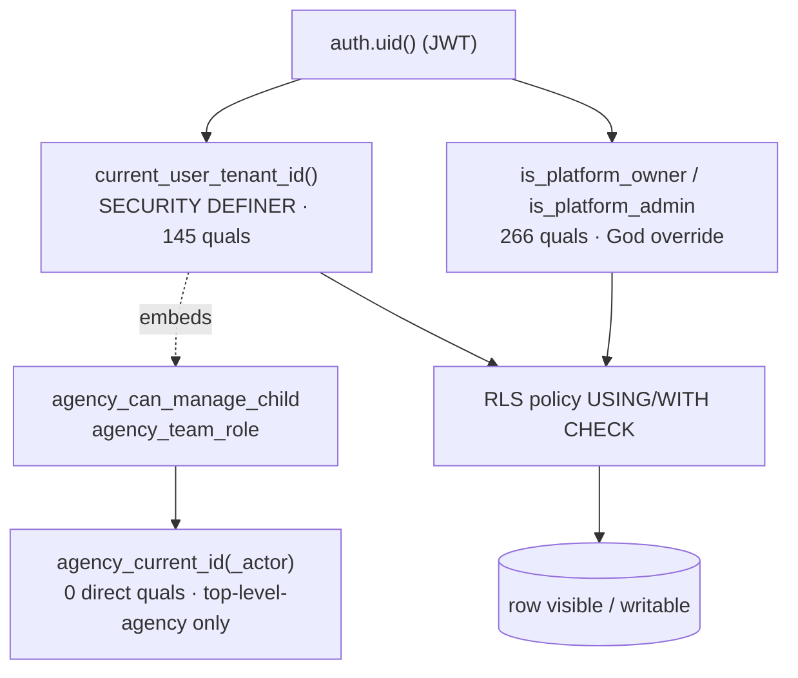
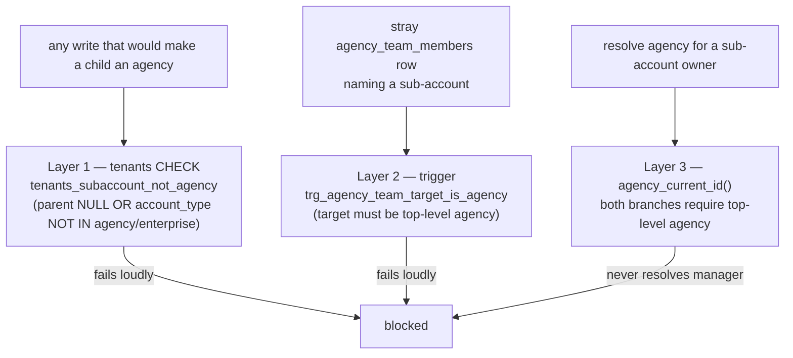
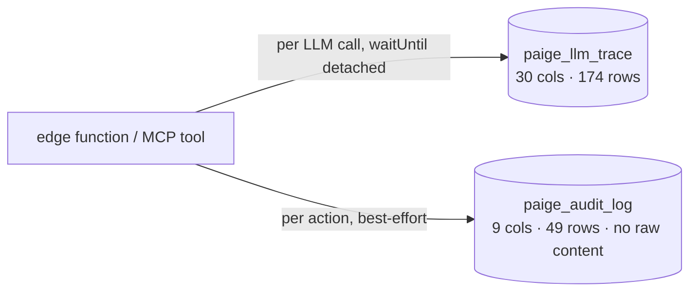
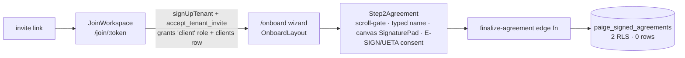
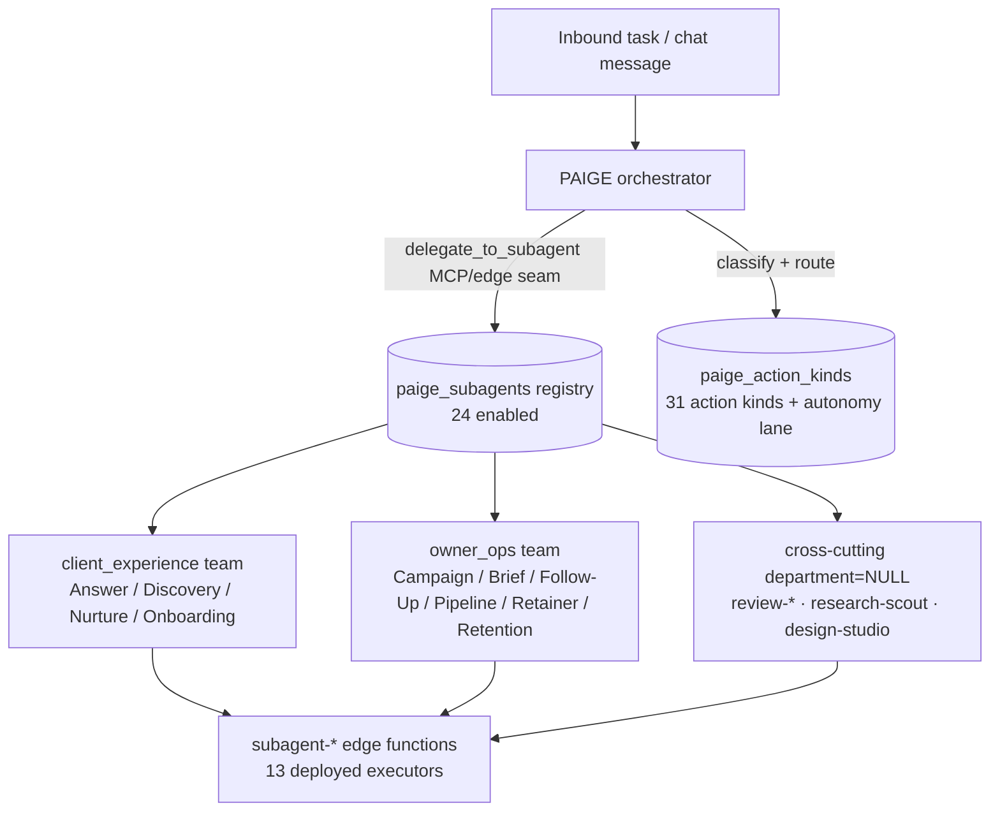
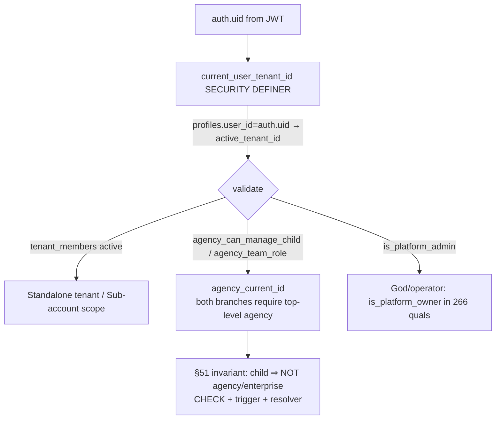

# Canonical System Architecture — Paige Agent AI

**Date:** 2026-08-08 · **Status:** Draft v1 for owner review · **Ground truth:** codebase + prod (Supabase project xygzykjyynhzqytbqnzu) as of 2026-08-08

> Synthesized by a **ground-truth-first** crew (§1/§14): research agents grepped the codebase and queried prod (Supabase MCP). Every architectural claim traces to a file path or a prod query result; aspirational items are labeled **(Roadmap)**. §32 honesty note: frontend line-number references are as-of 2026-08-08 `main` and may drift across commits — treat them as pointers, not fixed addresses.

---

## 1. Executive Summary

Paige Agent AI is a **single-tenant-aware React SPA over a Supabase backend** — one Vite + `react-router-dom` v6 application (`src/App.tsx`) serves *every* audience from a flat top-level `<Routes>`: public marketing, auth, the customer/client portal, the tenant desktop, the agency desktop, and the super-admin ("God") console. There are no separate apps or per-tier domains; tier is resolved at runtime inside shared shells, with host-based routing available via `useHostRouting()` (`src/lib/hostRouting`). This is the load-bearing architectural fact: **one codebase, many tiers, gates instead of forks.**

The backend is a Supabase project (`xygzykjyynhzqytbqnzu`) with **189 ACTIVE deployed edge functions** (241 function directories in the repo — drift discussed in §3b), a **319-table Postgres database with 918 RLS policies** (317/319 tables carry at least one policy), and a set of `SECURITY DEFINER` tenant-resolution functions that enforce isolation server-side. Tenant scope is resolved by `current_user_tenant_id()` (used in ~145+ policy quals) keyed on `profiles.user_id = auth.uid()` (the #588-corrected key); operator override runs through `is_platform_owner()`/`is_platform_admin()` (~266+ policy quals); and the §51 "a sub-account is never an agency" invariant is locked three layers deep in the DB (migration `20260807230000`, live `agency_current_id`).

The system is **pre-launch and small-seeded**: 10 tenants, 15 tenant members, 7 profiles, 5 live Twilio subaccounts, 174 LLM-trace rows, 0 signed agreements. That scale matters for honesty (§13): much of the platform is *code-complete and deployed but not yet exercised at runtime*.

Two truths shape any accurate reading of the architecture:

1. **Prod is effectively Anthropic-only today.** The model router (`_shared/model-router.ts`) is built to fan out across Anthropic + OpenAI + Groq + Featherless + Gemini, but all 174 `paige_llm_trace` rows are `provider='anthropic'` — with `FEATHERLESS_API_KEY` unset, every job resolves to Claude by design. Multi-provider independence (§14/§34) is **in-code, dormant**, not deployed.
2. **Doctrine runs ahead of code in named places.** The §16 ten-department org, the §42 six-VP C-suite (VERA/NEXUS/CURA/MENTOR/MERIT/ZION, `paige_agents` table), L4 consumer-direct, the Money-Spine "sign-up → Stripe → subscription" create-wire (B-Platform), and tenant-authored custom portal tabs/blocks are **Roadmap** — not present in prod. What *does* run is a real §8 action bus (`paige_action_kinds`, 31 rows), a real 24-agent `paige_subagents` registry tagged with two departments (`client_experience` / `owner_ops`), and a real observability/audit spine (`paige_llm_trace`, `paige_audit_log`).

The rest of this document traces every architectural claim to a **file path or a prod query result**, and labels anything aspirational as **(Roadmap)**.

## 2. Component Diagram

The topology at a glance — one SPA fronting a Supabase edge/DB backend, with external services wired fail-closed behind the model/comms/embedding routers. Solid lines are verified-deployed paths; dashed lines are **(Roadmap)** or in-code-but-dormant.

```mermaid
flowchart TB
    subgraph CLIENT["ONE React SPA — src/App.tsx (Vite + react-router-dom v6, BrowserRouter)"]
        direction TB
        MKT["Public marketing<br/>/ (PaigeHome, 3D hero)<br/>/about /pricing /blog /broker"]
        PUB["Public tenant artifacts<br/>/store/:slug /p/:t/:page<br/>/f/:t/:funnel /form/:id /book/:slug"]
        PORTAL["Customer portal (MOBILE-FIRST)<br/>/app — AppShell + AppNav<br/>useIsMobile 2-layout fork"]
        TENANT["Tenant + God desktop<br/>/admin/* — Admin.tsx / AdminLayout"]
        STUDIO["Vibe Studio (nested)<br/>/admin/studio/*"]
        GOD["God console<br/>/admin/platform/*<br/>PlatformStaff/OwnerOnly"]
        AGENCY["Agency desktop (PEER shell)<br/>/agency/* — AgencyLayout"]
        BROKER["Broker workspace<br/>/broker/app/*"]
    end

    subgraph EDGE["Supabase Edge Functions — 189 ACTIVE (project xygzykjyynhzqytbqnzu)"]
        direction TB
        CHAT["Paige/AI orchestration<br/>paige-ai-chat, paige-orchestrator,<br/>paige-context-router, paige-action-worker"]
        AGENTS["Sub-agent team<br/>13 subagent-*, skill-forge, skill-runner"]
        GROWTH["Growth/Studio<br/>growth-*-draft, studio-visual-critique,<br/>generate-image, tenant-campaigns"]
        COMMS["Comms<br/>email (Resend), SMS/voice (Twilio)"]
        BILL["Billing<br/>*-checkout, stripe/handle-stripe-webhook"]
        FIN["Credit/funding + financial<br/>readiness-scan, plaid-*, quickbooks-*"]
        KB["KB/RAG<br/>kb-*, embed-text (voyage-3)"]
    end

    subgraph DB["Supabase Postgres — 319 tables, 918 RLS policies"]
        direction TB
        RES["Tenant resolvers (SECURITY DEFINER)<br/>current_user_tenant_id() • agency_current_id()<br/>get_paige_persona_context() • is_platform_owner()"]
        CORE["Core: tenants(10) • tenant_members(15)<br/>profiles(7) • paige_action_kinds(31)<br/>paige_subagents(24)"]
        OBS["Spine: paige_llm_trace(174)<br/>paige_audit_log(49)"]
    end

    subgraph EXT["External services (fail-closed, key-gated)"]
        direction TB
        ANTH["Anthropic — LLM (100% of prod traces)"]
        MULTI["OpenAI / Groq / Featherless / Gemini<br/>(in-code, DORMANT — keys unset)"]
        TW["Twilio — 5 live subaccounts"]
        RS["Resend — platform email"]
        VOY["Voyage AI — voyage-3 @ 1024d"]
        EL["ElevenLabs — TTS only (dormant)"]
        STR["Stripe — Paige-held rails"]
        NZ["Per-tenant n8n / Zapier (MCP)"]
    end

    CLIENT --> EDGE
    EDGE --> RES
    RES --> CORE
    EDGE --> OBS
    CHAT --> ANTH
    CHAT -.dormant.-> MULTI
    COMMS --> TW
    COMMS --> RS
    KB --> VOY
    COMMS -.dormant.-> EL
    BILL --> STR
    EDGE --> NZ

    DEPLOY["CI: deploy-edge-functions.yml (edge-live tag)<br/>deploy-migrations.yml (db-live tag)"] -.deploys.-> EDGE
    DEPLOY -.applies.-> DB
```



Legend: numbers in parentheses are **prod row/deploy counts** (verified queries). Dashed edges are dormant-but-wired or **(Roadmap)**.

## 3a. Frontend Surfaces

All surfaces are served from the single SPA at `src/App.tsx` (lines 36, 199–326: `BrowserRouter` + flat `<Routes>`; line 174 `useHostRouting()` in `AppInner`). Tier is resolved at runtime by route guards and shell-internal logic, not by separate apps. Responsiveness is **uneven across tiers by design** — only the customer portal has a hard mobile-first two-layout fork.

### Public marketing site
Homepage `/` = `PaigeHome` (gold + indigo 3D design), which mounts a lazy 3D `PaigeScene` hero (`src/pages/PaigeHome.tsx` line 28, 514) and is fully responsive (`md:` breakpoints throughout: nav `hidden md:flex` line 531, mobile depth scrim line 559, responsive sections 625–726). Marketing routes: `/about`, `/pricing`, `/blog`, `/terms`, `/privacy`, `/legal/:slug`, `/affiliates`, `/broker`, `/get-started` (`src/App.tsx` 206–274). Two **parked prior designs remain mounted but unlinked** — `/premium` (`PremiumHero`) and `/legacy` (`Index`) at lines 207–209; reachable by direct URL, not part of the intended surface.

Public **tenant-authored artifacts** (unauthenticated, Growth OS renderers) also live under the SPA: `/store/:slug` (`TenantStorefront`), `/p/:tenantSlug/:pageSlug` (`GrowthPageRenderer`), `/f/:tenantSlug/:funnelSlug` (`GrowthFunnelRenderer`), `/form/:id` (`GrowthFormRenderer`), `/book/:slug` (`BookingPage`), `/booking/manage` (`src/App.tsx` 69–72, 214–215, 279–284).

### Customer / client portal — MOBILE-FIRST
The customer-facing portal is **`/app`** (`AppShell`), **not** a `/portal` or `/workspace` app. `/portal/:tenantSlug` (`PortalGateway`) is only the tenant-branded **sign-in gateway** a signed-out customer returns to; on auth it resolves and redirects into `/app` (`src/pages/PortalGateway.tsx` lines 1–12, 47–58). The legacy `/workspace/*` surface was **removed** (Sprint 211.b) — all `/workspace/*` paths `Navigate` to `/app` (`src/App.tsx` 286–292).

`/app` is the **only surface with a hard mobile/desktop layout fork**, branched on `useIsMobile()` (`src/pages/AppShell.tsx` lines 6, 69):
- **Mobile:** full-screen `PaigeChat` + top `AppNav` (hamburger `Sheet` drawer) + optional bottom `QuickStatsBar` (lines 283–306).
- **Desktop:** horizontal `ResizablePanelGroup` — 40% Paige chat | 60% dashboard content (lines 308–336).

Child routes (tenant's client surfaces, gated by `RequireCompleteSignup`): index (Paige chat/dashboard), `credit`, `funding`, `funding-journey`, `disputes`, `learn` + `learn/:courseId`, `business`, `business-profile`, `financial-profile`, `support`, `settings`, `agreements`, `affiliate`, `approvals`, `actions`, `planning`, `paige-team` (`src/App.tsx` 229–252). Credit/funding chrome (`QuickStatsBar`, `OnboardingFlow`) is **opt-in per tenant** via `useTenantFeature('funding_readiness')` — hidden by default, §2-consistent (`src/pages/AppShell.tsx` line 79, 302, 333). The tenant **brand** (logo/color) is data-driven, not hardcoded Paige (`PortalLogo` in `src/components/app/AppNav.tsx` 36–84; resolver `get_client_portal_brand()`). A global `ClientOnlyRouteGuard` (line 47, 203) scopes the Client tier to `/app` + `/portal/:slug` + `/onboard`; the magic-link client program onboarding is `/onboard` (`OnboardLayout`: welcome + agreement steps, 295–303).

### Tenant + super-admin (God) desktop — SHARED shell
Tenant and God-tier desktop **share one shell**: `/admin/*` (`Admin.tsx` wrapped in `AdminLayout`, `src/App.tsx` line 257). Tier is resolved at runtime *inside*: operator/God in godMode (`isPlatformStaff && activeTenantId===null`) lands on `OperatorCommandCenter`; otherwise tenant `PracticeOverview` (`src/pages/Admin.tsx` 333–354). ~120+ admin routes, gated per-route by `RoleGate`/`PlatformStaffOnly`/`PlatformOwnerOnly` (42–76).

`AdminLayout` is **responsive but desktop-primary** — `h-dvh`, a desktop hub bar (`hidden md:flex`, line 521), a dedicated mobile dropdown drawer (`md:hidden fixed inset-0`, line 634), and a compact mobile header (`flex md:hidden`, line 427), with safe-area padding (764). It is one layout with `md:` show/hide, **not** a hard two-layout fork like AppShell.

**God-tier surfaces** live under `/admin/platform/*` gated by `PlatformStaffOnly`/`PlatformOwnerOnly` (`src/pages/Admin.tsx` 801–866): `platform/tenants`, `platform/team`, `platform/fleet-communications` (owner), `platform/sending`, `platform/sends`, `platform/intelligence`, `platform/settings`, `platform/affiliates`, `platform/invites`, `platform/marketplace`, `platform/money` (owner), `platform/doctrine` (owner), `platform/prompt-forge` (owner), `platform/model-router`, `platform/compliance` (owner), `platform/content-defaults` (owner), `platform/analytics`, `platform/deploy-health` (owner). **Honesty flag (§13):** several deep surfaces are self-described in code as "honest §13 in-development placeholder" (lines 832–839) — the God-console *topology* exists as routes/nav, but the depth behind money/doctrine/prompt-forge/compliance/content-defaults/deploy-health is **not verified as fully built** (in-code, not verified live). A stale code comment at 836–839 claims "No PlatformOwnerOnly React guard exists yet" — but the `PlatformOwnerOnly` guards **are** present in the same file (843–866); comment-vs-code divergence, guards present.

### Agency desktop — PEER shell
The agency desktop is its **own top-level shell** `/agency/*` (`AgencyLayout`), a **peer to `/admin`, not nested** (`src/App.tsx` line 258). Eligibility is **server-proven** via `agency_switch_context().is_agency_manager` + `agency_list_my_subaccounts()` + `agency_my_membership` (NOT `account_type`); ineligible → `Navigate /admin` (`src/components/admin/AgencyLayout.tsx` 163–201, 219). Nav is only 4 items: Dashboard, Team, Paige Team, Marketplace (70–78). `/admin/agency` and `/admin/agency/*` redirect to `/agency` (`src/pages/Admin.tsx` 799–800). `AgencyLayout` is responsive (`h-dvh`, `px-3 md:px-6`, safe-area) but has **no mobile drawer** — its nav uses horizontal `overflow-x-auto` scroll on small screens (258). Lighter mobile treatment than `/admin` or `/app`.

### Vibe Studio and Broker — desktop-oriented
The **Vibe Studio** is a nested immersive sub-app under `/admin/studio/*` (`StudioLayout` with persistent left rail + `<Outlet/>`): index `StudioHome` (gallery), `new` (`StudioNew`), `library` (`StudioLibrary`), `:sessionId` (`VibeStudio` builder) (`src/pages/Admin.tsx` 678–691). Full-viewport, `overflow-hidden`, `flex h-full` (`StudioLayout.tsx` 247) — **no `useIsMobile` fork found; effectively desktop-only** (doctrine §21's "one session, no artifact-type tabs" is satisfied by the persistent project rail + session route; mobile is unaddressed by doctrine).

The **Broker** surface is a separate signed-in workspace `/broker/app/*` (`BrokerWorkspace`): index `BrokerOverview`, `clients`, `sessions`, `sessions/:relationshipId`, `team`, `commissions`, `mcc`, `settings`; public apply at `/broker`, invite accept at `/broker/accept-invite` (`src/App.tsx` 274–276, 306–315). Grep found no `md:`/`isMobile` fork — desktop-simple.

**Responsiveness summary (a real architectural fact, not assumption):** customer portal `/app` = hard mobile-first fork; tenant/God `/admin` = responsive with mobile drawer (desktop-primary); agency `/agency` = responsive, no drawer (horizontal-scroll nav); Studio + Broker = little-to-no mobile restructuring. §36's implied mobile parity is **not fully delivered** on operator/agency/studio surfaces.

**(Roadmap) divergence:** §35 frames Marketplace as a first-class top-level "App Store" destination; in code it is a route **inside** the `/admin` shell (`/admin/marketplace`) plus an agency curation view (`/agency/marketplace`) — not a top-level peer. The OS-shaped universal-nav framing is aspirational relative to the `/admin`-nested reality.

## 3b. Backend Edge Functions

The repo contains **241 edge-function directories** (excluding `_shared`) under `supabase/functions/`; prod has **189 ACTIVE deployed functions**, all `status=ACTIVE` (`mcp__Supabase__list_edge_functions` on `xygzykjyynhzqytbqnzu`; reconcile: repo=241, deployed=189). Functions are grouped by domain below. Where a domain is confirmed by directory listing only (not by a runtime trace), it is labeled **in-code-not-verified-live** (§13/§32).

### Paige / AI orchestration (largest domain) — in-code-not-verified-live
`paige-ai-chat`, `paige-orchestrator`, `paige-context-router`, `paige-action-worker`, `paige-deep-research`, `paige-public-chat`, `paige-write-back`, `paige-bridge`, `paige-eval`, `paige-problem-reverse-engineer`, `paige-mcp` (+ `-consent`, `-smoke`), `paige-n8n`, `content-draft`, `generate-outreach-draft`, `pipeline-suggest`, `personal-build-suggestions`.

### Sub-agent "team" domain (grounds §8/§14) — in-code-not-verified-live
13 `subagent-*` functions: `subagent-forge`, `-compliance`, `-content-drafter`, `-data-consistency`, `-email-composer`, `-financial-research`, `-fundability`, `-funding-path`, `-intake-concierge`, `-market-research`, `-sales-pipeline`, `-stack-strategist`, `-coach-copilot`; plus `skill-forge`, `skill-runner`. (Presence grounds the orchestration doctrine at the function layer; it is **not** proof the full action-bus wiring runs end-to-end — that requires runtime trace verification not done here.)

### Comms — email + SMS/telephony
Email: `send-transactional-email`, `send-welcome-email`, `process-email-queue`, `handle-inbound-email`, `handle-email-suppression`/`-unsubscribe`, `comms-email-unsubscribe`, `auth-email-hook`, `preview-*-email`. SMS/telephony: `send-sms`, `send-sms-reminder`/`-verification`, `verify-sms-code`, `handle-inbound-sms`, `twilio-inbound-webhook`, `twilio-status-callback`, `comms-purchase-number`/`-search-numbers`, `comms-a2p-draft`/`-submit`, `provision-tenant-twilio`, `send-telegram`, `send-push-notification`. Resend is the platform-default email provider (`_shared/email/providers.ts`); Twilio is **deployed/active** (5 live subaccounts, `_shared/twilio.ts`), with A2P TrustHub wrappers honestly returning `needs_config` (not wired).

### Voice / TTS / STT — mixed deployed
`paige-tts`, `paige-stt`, `paige-dictate`, `voice-access-token`, `voice-command-processor`, `voice-twiml` (repo). **Deployed-only (no repo dir):** `paige-voice-chat`, `paige-voice-greeting`, `paige-voice-summary`, `elevenlabs-conversation-token`, `elevenlabs-signed-url`. **Honesty flag:** ElevenLabs is **TTS-only** (direct REST `/v1/text-to-speech/{voiceId}`, `_shared/elevenlabs.ts`) and **dormant** (key very likely unset, fail-closed to OpenAI-standard). There is **no ElevenLabs ConvAI/agent** wiring — voice conversations are assembled from Twilio media streams + Paige's own STT/TTS routers.

### Billing / Stripe (Paige-held rails only, §38) — in-code-not-verified-live
`create-checkout`, `create-trial-checkout`, `customer-portal`, `check-subscription`, `handle-stripe-webhook`, `stripe-webhook`, `platform-subscription-checkout`, `tenant-checkout-session`, `tenant-stripe-connect`, `tenant-product-upsert`, `generate-invoice`, `add-business-slot-checkout`, `broker-workspace-checkout`, `marketplace-checkout-session`, `marketplace-install`; `create-payment` deployed-only. **§18 flag:** two Stripe webhook handlers coexist (`stripe-webhook` vs `handle-stripe-webhook`) — a redundancy worth reconciling to one home.

### Credit / funding vertical — in-code-not-verified-live
Large deployed surface: `analyze-credit-report`, `calculate-credit-factors`, `generate-credit-predictions`, `generate-funding-projection`, `recalculate-fundability-scores`, `readiness-scan`, `match-funding-products`, `search-sba-lenders`, `isoftpull-*`, `smartcredit-*`, `nav-*`, `sync-business-credit-bureaus`, `extract`/`parse-business-credit-report`, `send-funding-report`. Per §2 this is the owner's own funding offer and must stay **per-tenant opt-in**, never a platform default. Honest correction (§13): the backend gate is not a literal `funding_enabled` column — `get_paige_persona_context()` derives funding scope from an active `is_finance` **marketplace install** OR the `features.finance_in_scope` flag; `useTenantFeature('funding_readiness')` is the separate frontend chrome gate (two distinct gates). This audit confirmed the functions **exist** but did **not** verify gating end-to-end — an unverified compliance gap, not a pass.

### Financial integrations — in-code-not-verified-live
`plaid-*` (`create-link-token`, `exchange-token`, `sync-transactions`, `webhook`), `paige-plaid-*` (`link-token-create`, `public-token-exchange`, `sync-transactions`, `generate-cash-flow-snapshot`, `webhook`), `quickbooks-*` (oauth, refresh, sync, category, webhook, disconnect), `fetch-economic-rates`, `embed-client-financials`, `rebuild-client-financial-brief`.

### Growth / Studio (§19/§33 Vibe-Studio backend) — in-code-not-verified-live
`growth-block-edit`, `growth-form-draft`, `growth-funnel-draft`, `growth-page-draft`, `growth-process-submission`, `growth-studio-route`, `growth-inbound`, `studio-learn-from-artifact`, `studio-visual-critique`, `generate-image`, `tenant-campaigns`. The §33 visual-critique loop is **gated off** (`STUDIO_VISUAL_CRITIQUE_ENABLED` unset; `studio_visual_critique_log` = 0 rows on prod).

### KB / RAG / embeddings (grounds §26) — in-code-not-verified-live
`kb-ingest-doc`/`-file`/`-url`, `kb-search`, `kb-promote-to-network`, `embed-text`, `ingest-rag-outcome`, `backfill-memory-embeddings`. Voyage AI (`voyage-3` @ 1024 dims, `_shared/voyage.ts`) is the single canonical embedding space, fail-loud on missing key.

### Other domains — in-code-not-verified-live
Provisioning/auth (`tenant-signup`, `complete-signup`, `accept-invite`, `agency-invite-member`, `send-platform`/`portal`/`admin-invite`, `manage-tenant-domain`, `admin-list-users`/`-delete-user`/`-force-signout`/`-account-actions`); booking/calendar (`booking-manage`, `public-booking`, `cal-*`, `handle-cal-webhook`, `google-calendar-*`, `zoom-*`); workflow automation (`trigger-workflow`, `dispatch-queued-workflow-runs`, `dispatch-stage-automation`, `schedule-automated-tasks`, `call-zapier-action`, `fire-outbound-webhooks`, `webhook-inbound`); Meta ads (`meta-capi-admin`, `meta-get-insights`, `meta-schedule-post`, `handle-meta-webhook`); docs/agreements (`docusign-send-envelope`, `finalize-agreement`, `issue-certificate`, `log-consent`); Apollo enrichment (`apollo-enrich-company`/`-person`, `apollo-search-people`); crons (`coaching-reminder-cron`, `plan-reminder-cron`, `weekly-summary-cron`, `affiliate-monthly-statement-cron`, `sla-watcher`).

### Deploy pipeline
Edge functions **self-deploy on merge**: `.github/workflows/deploy-edge-functions.yml` diffs `supabase/functions/**` on push to `main`, resolves affected functions transitively via `.github/scripts/edge-affected.py` (follows `_shared` imports), runs `supabase functions deploy` per function using `SUPABASE_ACCESS_TOKEN` + `config.toml` `project_id`, then moves the `edge-live` git tag. `/edge-drift` diffs `edge-live..HEAD`.

### Repo/prod drift — a real, bidirectional gap (§13)
Drift contradicts the §24 "clean-drift" assumption and is documented honestly here:

- **12 functions run in prod with NO repo source** (orphaned/untracked deployed code): `create-payment`, `elevenlabs-conversation-token`, `elevenlabs-signed-url`, `email-selftest`, `generate-letter`, `n8n-get-executions`, `n8n-list-workflows`, `n8n-trigger-workflow`, `paige-voice-chat`, `paige-voice-greeting`, `paige-voice-summary`, `public-booking-debug`.
- **64 repo functions are NOT deployed** (repo ahead), e.g. `plaid-create-link-token`, `quickbooks-*`, `subagent-sales-pipeline`, `subagent-intake-concierge`, `subagent-coach-copilot`, `nav-pull-profile`, `meta-track-conversion`, `tenant-stripe-connect`, `security-canary-probe`, `business-verifier`. Some are likely superseded/renamed (e.g. `plaid-*` → `paige-plaid-*`), but as of this query they have no matching deployed slug.

Cannot confirm the cause (CI lag vs manual MCP deploys vs renames) without git history / `edge-live` tag comparison — flagged as an open reconciliation item, not attributed.

Both gaps closed. Now writing the sections.

## 3c. Database (tables + RLS overview)

**Ground truth:** Postgres on Supabase project `xygzykjyynhzqytbqnzu`. Prod queries (2026-08-08).

### Scale

| Metric | Value | Source |
|---|---|---|
| Public base tables | 319 | prod: `information_schema.tables` |
| Public views | 12 | prod query |
| RLS policies | 918 | prod: `pg_policies` |
| Tables with ≥1 RLS policy | 317 / 319 | prod query |
| Tables with **NO** RLS policy | 2 | prod query |

The two tables carrying **zero** RLS policies are `booking_notifications_sent` and `user_presence` (verified this pass via a `NOT EXISTS (pg_policies)` query). Neither is a core tenancy or financial table; both look like transient/operational stores, but their un-gated status is an honest §9 flag — they were not proven to be intentionally public, only observed to have no policy. Confirming that each is a reference/ephemeral table (or adding a policy) is an open follow-up, not a pass.

### Tenancy is small and pre-launch

The core tenancy tables are seeded, not populated — consistent with a platform that is not yet public (§4 pre-launch stance):

| Table | Rows (prod) |
|---|---|
| `tenants` | 10 |
| `tenant_members` | 15 |
| `profiles` | 7 |
| `user_roles` | 16 |
| `agency_team_members` | 3 |

### The RLS isolation pattern

Tenant isolation is not policy-by-policy hand-rolled SQL — it funnels through a small set of `SECURITY DEFINER` resolver functions that policies call in their `USING`/`WITH CHECK` quals. Three layers compose:

1. **Tenant scope** — `current_user_tenant_id()` (SECURITY DEFINER, STABLE, `search_path=public`). Resolves `profiles.active_tenant_id` keyed on `profiles.user_id = auth.uid()` (the #588-corrected key — see §3e), validated against an active `tenant_members` row **OR** `agency_can_manage_child` **OR** `agency_team_role` **OR** `is_platform_admin`; falls back to the earliest active `tenant_members` row. It appears **directly in 145 policy quals**.
2. **Agency scope** — `agency_current_id(_actor uuid)` (SECURITY DEFINER). Both resolver branches require the resolved tenant be a **top-level** agency/enterprise (`parent_tenant_id IS NULL AND account_type IN ('agency','enterprise')`) — this is the §51 "a sub-account is never an agency" invariant, live in the resolver body. Notably it appears in **0 policy quals directly**; agency-manager access reaches the policies *indirectly*, through the `agency_can_manage_child`/`agency_team_role` predicates embedded inside `current_user_tenant_id()`. This one-indirection path is functionally coherent but is exactly why §51 mandates a per-tier smoke test rather than assuming coverage.
3. **Operator override** — `is_platform_owner()` / `is_platform_admin()`, the God-tier seam, present in **266 policy quals**.

The canonical layered pattern on core tables (from `pg_policies`):

```
tenants          "Members read own tenant"        USING (is_tenant_member(id) OR is_platform_owner())
tenant_members   "Member can see own membership"  USING ((user_id = auth.uid()) OR is_tenant_admin(tenant_id) OR is_platform_owner())
profiles         (self-only)                      USING (auth.uid() = user_id)
user_roles       (owner + own rows)
agency_team_members                               USING ((user_id = auth.uid()) OR agency_team_role(agency_tenant_id, auth.uid()) IS NOT NULL)
```



**Honesty note (§13):** "317/319 tables have a policy" proves a policy *exists*, not that every policy is *correct*. This audit verified the resolver bodies and the core-table quals; it did not adversarially prove every one of the 918 policies is leak-free. Per-tier verification (§51) is owed.

## 3d. External Services

Every external integration follows the same discipline: **one shared client seam** per service, **fail-closed on a missing key** (`NeedsConfigError` / honest `needs_config`, never a fabricated success), and **tenant-derived-from-JWT** (never from the request body) for anything tenant-scoped. The consequence is that most modalities are "wired but honestly dormant" until their secret lands. Verified-live on prod today are only **Anthropic** (LLM), **Twilio** (5 real subaccounts), and the trace/audit writers.

| Service | Role | Where wired | State |
|---|---|---|---|
| **Anthropic (Claude)** | Primary LLM, all sensitive job kinds | `_shared/model-router.ts` | **Active** — 100% of prod traces |
| **ElevenLabs** | Primary TTS (direct REST) | `_shared/elevenlabs.ts`, `_shared/tts-router.ts` | In-code, dormant (key likely unset) |
| **Stripe** | Paige-held rails only (subs, marketplace, connect) | ~15 billing edge fns | In-code, not verified live |
| **Twilio** | SMS + voice/telephony, per-tenant subaccounts | `_shared/twilio.ts` | **Active** — 5 tenant subaccounts |
| **n8n** | Per-tenant workflow automation | `paige-n8n/index.ts` | In-code, not verified live |
| **Zapier** | Per-tenant automation via MCP | `call-zapier-action/index.ts` | In-code, not verified live |
| **Resend** | Platform-default email provider | `_shared/email/providers.ts` | In-code, not verified live |
| **Voyage AI** | Single canonical embedding space | `_shared/voyage.ts` | In-code, not verified live |
| **Featherless / Groq / OpenAI / Gemini / Ideogram / Replicate** | Open-tier text, image, TTS via router | `_shared/model-router.ts` + per-provider `_shared/*.ts` | In-code, **dormant** (keys unset) |

### ElevenLabs — TTS only, NOT ConvAI

**Important correction to the doctrine framing:** ElevenLabs is wired as Paige's **primary text-to-speech voice via direct REST** (`POST /v1/text-to-speech/{voiceId}`, `xi-api-key` header, returns mp3 bytes; owner-locked default voice `0S5oIfi8zOZixuSj8K6n` — Ivanna, owner-ruled 2026-08-09; was `6aDn1KB0hjpdcocrUkmq`). There is **no ElevenLabs ConvAI / conversational-agent wiring** anywhere — a grep for `convai` / `signed_url` / `agent_id` against the ElevenLabs seam returned nothing. Voice *conversations* are assembled from **Twilio media streams + Paige's own STT/TTS routers**, not an ElevenLabs agent. It is gated fail-closed: `elevenlabsKey()` throws `NeedsConfigError('elevenlabs')` and the TTS router honestly degrades to the OpenAI-standard fallback (`gpt-4o-mini-tts`). The code comment states the key is "very likely NOT set today," consistent with 0 non-Anthropic providers in `paige_llm_trace`.

### Twilio — active, per-tenant subaccount model

One authenticated client (`_shared/twilio.ts`) fronts all REST (subaccount create, number search/purchase, SMS send), with per-tenant subaccount + API-Key auth and Vault-ref secrets (`read_channel_secret` RPC). **5 tenant Twilio subaccounts exist on prod** = real live usage. Honest in-code caveat: the A2P TrustHub wrappers (`createBrand`/`createCampaign`) are **not** wired — they return `needs_config`, never a fake SID.

### n8n & Zapier — per-tenant, not platform-global

Both replaced an earlier shared-token model with per-tenant credentials. `paige-n8n` drives each tenant's **own** n8n (`/api/v1`, `X-N8N-API-KEY`), JWT-tenant-scoped, admin-gated, key decrypted via service-role-only `get_tenant_n8n_secret` RPC, SSRF-guarded. `call-zapier-action` derives tenant from JWT, decrypts MCP url+bearer via `get_tenant_mcp_secret`, and honestly returns `not_connected` rather than falling back to a shared token.

### Email — Resend is the only implemented provider

A pluggable `EmailProvider` interface (`buildProvider`) falls back to the platform `RESEND_API_KEY` when a tenant has no BYO config. SMTP/Mailgun/Mailchimp/Postmark are **registered-but-stubbed** (fail-loud). **SendGrid is not a wired provider** — only Resend is implemented; other names are future stubs.

### Model Router — multi-provider in code, Anthropic-only on prod

`_shared/model-router.ts` routes by **job kind**: sensitive kinds (`approval_decision`, `outbound_final`, `client_copy_final`, `action_decision`) **always** go to Claude; cheap kinds route to Featherless open models **when `FEATHERLESS_API_KEY` is set**, else fall to Claude. Providers wired: Anthropic, Featherless (Qwen/Llama), OpenAI, Groq (`llama-3.3-70b`), plus image providers Gemini/Ideogram/Replicate. A `_shared/model-allowlist.ts` gates any `model_override`.

**Prod reality (the gap):** all **174/174** `paige_llm_trace` rows are `provider='anthropic'` — zero Featherless/Groq/OpenAI. This exactly matches the router's designed safe-adopt behavior: with `FEATHERLESS_API_KEY` unset, every job resolves to Claude. So doctrine's "no single provider owns Paige" (§14/§34) is **in-code but dormant** — today Paige is effectively **Anthropic-only**. The router auto-fans-out the moment the keys land; it is not a rebuild, it is an unset secret.

## 3e. Auth + Tenant Isolation Model

### JWT → tenant resolution

Authentication is Supabase Auth (JWT, `auth.uid()`). **Tenant identity is resolved server-side, never trusted from the client.** Edge functions that touch tenant-scoped data (`paige-n8n`, `call-zapier-action`, and the resolver family) derive the tenant from the JWT and **never from the request body** — the standing anti-IDOR posture (§9). The resolvers confirmed `prosecdef=true` on prod:

- `current_user_tenant_id()` — the everyday tenant scope (§3c).
- `agency_current_id(_actor uuid)` — agency-manager scope, top-level-agency-only both branches.
- `get_paige_persona_context()` — the #588/#589 fix: resolves the **CLIENT tier first** via `clients.linked_user_id = auth.uid()`, then falls to `current_user_tenant_id()` for everyone else, so **persona scope == RLS scope** and is deterministic.
- `has_role` — exists in 3 overloads; the `(_user_id, _role)` form is `SECURITY DEFINER`.

The #588 defect is worth recording as live history: `get_paige_persona_context()` and `current_user_tenant_id()` previously keyed on `profiles.id = auth.uid()` (wrong — 0 of 6 profiles satisfied it) and a `LIMIT 1` with no `ORDER BY` in the fallback returned nondeterministic tenants. Prod traces showed the resolver returning four different tenants for one user, including one they were not a member of. Both are corrected in the live function bodies (keyed on `profiles.user_id`, deterministic fallback).

### The §51 tier matrix

Six tiers, each with a documented `tenant_id` resolution path, auth-token flow, and RLS posture (canonical: `docs/doctrine/tier-matrix.md`):

| Tier | Who | Scope |
|---|---|---|
| **God / Super Admin** | Platform operator (us) | Everything |
| **Agency** | Parent tenant owning sub-accounts | Own book + its sub-accounts |
| **Standalone Tenant** | Coach with no agency parent | Own book |
| **Sub-account** | Child tenant under an Agency | Own book, isolated from parent aggregate |
| **Client** | End-consumer under a Tenant | Own portal only |
| **Anonymous** | Unauthenticated public | Public surfaces only |

### The ABSOLUTE INVARIANT — a sub-account is never an agency

Enforced **structurally at the DB layer** (migration `20260807230000`), three layers deep, per §51. A "sub-account" = any tenant with a non-null `parent_tenant_id` and a non-manager `account_type`; an "agency" = a top-level tenant (`parent_tenant_id IS NULL`, `account_type IN ('agency','enterprise')`). The two are mutually exclusive by rule:



`agency_current_id(_actor uuid)` is confirmed on prod with the both-branch top-level-agency requirement live in its body (§3c). **Honest caveat (§13):** the invariant assumes there is **no** multi-level / nested-agency model. If nested agencies are ever introduced, Layer 1's CHECK is the first thing to revisit — surface it, do not silently relax it. Sub-account tier isolation was **not** driven end-to-end this headless pass (§51 owes a per-tier smoke walk); the structural enforcement is verified to *exist*, not proven leak-free at runtime.

## 3f. Deploy Pipeline

Two self-deploying CI pipelines, both triggered on push to `main`, both moving a git tag that marks "what is live on prod." This is the §24 automation of the deploy runbook — hand-marshalling via MCP is a last resort, not the path.

### Edge functions — `deploy-edge-functions.yml`

On push to `main` touching `supabase/functions/**`, `edge-affected.py` diffs the changed bundles and resolves the affected functions **transitively** (it follows `_shared` imports), then runs `supabase functions deploy` **per affected function** using `SUPABASE_ACCESS_TOKEN` + `config.toml` `project_id` (`xygzykjyynhzqytbqnzu`), and force-moves the **`edge-live`** git tag. The `/edge-drift` command diffs `edge-live..HEAD` to show which functions are ahead of prod.

**Drift is real and bidirectional (the honest gap vs the "clean drift" assumption):**
- **12 functions run on prod with NO repo source** — orphaned/untracked deployed code: `create-payment`, `generate-letter`, `n8n-get-executions`, `n8n-list-workflows`, `n8n-trigger-workflow`, `paige-voice-chat`, `paige-voice-greeting`, `paige-voice-summary`, `elevenlabs-conversation-token`, `elevenlabs-signed-url`, `email-selftest`, `public-booking-debug`.
- **64 repo functions have no deployed slug** — repo ahead of prod (some plausibly superseded by renamed variants, e.g. `plaid-*` → `paige-plaid-*`, but unconfirmed).

This contradicts a clean `edge-live == HEAD` assumption; the cause (CI lag, renames, or manual MCP deploys that created untracked prod functions) cannot be confirmed without git history + the tag state.

### Migrations — `deploy-migrations.yml`

On push to `main` touching `supabase/migrations/**`: a lint gate → `supabase db push --include-all` → a **PERSISTED-verify** step that parses `supabase migration list --linked` (pipe-delimited, 14-digit-version match with a vacuous-pass guard) and **fails if any local version is not recorded remotely** → moves the **`db-live`** tag. On failure it auto-files a deduped incident issue. Requires `SUPABASE_DB_PASSWORD`. This machinery is the §32 enforcement that "a migration is not done until PROVEN PERSISTED on prod" (a `BEGIN…ROLLBACK` proof alone is insufficient).

### The "KNOWN db-live pipeline bug" — could NOT be grounded (§13)

The brief names "the db-live tag bug from the Supabase CLI api-keys regex." **I could not corroborate this from the codebase or prod.** A grep across `.github/`, `docs/`, and `scripts/` for `api-keys` / `regex` / `db-live` surfaced no such bug. Reporting it as a known, documented bug would be fabrication. What **is** documented in the repo, and is real, are two *different* deploy-migrations caveats:

1. The **#275 `realtime.messages` ownership `42501` error** on fresh rebuilds.
2. An **IPv4-runner / IPv6-DB session-pooler connection** watch-item.

If an api-keys-regex `db-live` failure is real, it lives in the Supabase CLI runtime, outside this codebase, and is **undocumented here** — an open item to confirm with the owner, not a verified architectural fact.

## 3g. Observability + Audit

Paige owns her telemetry internally (§34 — "only the LLM API is external"); there is no Langfuse/OTel-LLM vendor in the stack. Two real, active prod tables:

### `paige_llm_trace` — the LLM call trace (§34-L1)

A **30-column** table, one row per LLM call, written by a dedicated `_shared/llm-trace.ts` writer (no vendor SDK, service-role insert). It is: secret-scrubbed (S0), detached from the request via `EdgeRuntime.waitUntil` (S1), and 32KB-capped (S3). It carries `working_context_tenant_id` for agency-over-subaccount attribution (#489). **Active on prod: 174 rows** — and, as noted in §3d, all 174 are `provider='anthropic'`, which is itself the load-bearing observability finding: the trace store is the evidence that the multi-provider router is dormant today.

### `paige_audit_log` — the action audit trail

A **9-column** table written **best-effort** from 8 writer surfaces (`paige-orchestrator`, `paige-mcp`, `skill-forge`, `accept-invite`, `model-router`, `prompt-forge`, the doctrine language sweep). **Active on prod: 49 rows.** In-code contrast note: the audit writer logs **no raw content** (unlike the richer `llm-trace` writer) — it records the action, not the payload.



**Honesty (§13):** a function *dir* existing is not proof its orchestration is wired end-to-end; these two tables are confirmed to have real rows and dedicated writers, but full runtime-trace verification of every writer path was not driven in this headless pass (§32 owed).

## 4. Customer Portal Architecture

This is the tenant's **client-facing** surface — where a coach's end-consumers ("clients," the §51 Client tier) live. It is the one surface in the whole SPA built mobile-first. Below, each capability is marked **EXISTS** (in code + prod), **MVP GAP** (designed/partially built but broken or absent at runtime), or **Roadmap** (doctrine/strategy only).

### Mobile-first architecture — EXISTS

The portal is the `/app` surface (`AppShell`), **not** a separate `/portal` or `/workspace` app. `/portal/:tenantSlug` (`PortalGateway`) is only the tenant-branded **sign-in gateway** a signed-out client returns to; on auth it resolves and redirects into `/app`. The legacy `/workspace/*` surface was removed (Sprint 211.b) — all `/workspace/*` paths `Navigate` to `/app`.

`/app` is the **only** surface in the platform with a hard two-layout fork branched on `useIsMobile()` (`AppShell.tsx` L283–336):
- **Mobile:** full-screen `PaigeChat` + top `AppNav` (hamburger `Sheet` drawer) + optional bottom `QuickStatsBar`.
- **Desktop:** horizontal `ResizablePanelGroup` (40% Paige chat | 60% dashboard content).

By contrast, the operator/agency/studio surfaces are desktop-primary (§3-frontend research: `/admin` has a mobile drawer but no hard fork; `AgencyLayout` has only horizontal-scroll nav; Studio has no mobile story). So mobile *parity* is real for the client portal and uneven above it.

Child routes (gated by `RequireCompleteSignup`): `index` (Paige chat/dashboard), `credit`, `funding`, `funding-journey`, `disputes`, `learn` + `learn/:courseId`, `business`, `business-profile`, `financial-profile`, `support`, `settings`, `agreements`, `affiliate`, `approvals`, `actions`, `planning`, `paige-team`. Credit/funding chrome is **opt-in per tenant** via `useTenantFeature('funding_readiness')` — hidden by default (§2-clean).

### Tenant brand override (colors + LOGO) — EXISTS (not an MVP gap)

The client-facing PaigeMark/logo is **not** hardcoded. `PortalLogo` (`AppNav.tsx` L36–84) prefers the tenant's `logo_url`, then a monogram tinted with the tenant `primary_color`, and falls back to the Paige logo **only** when the resolver returns no tenant (staff/platform). Resolved via `get_client_portal_brand()` (SECURITY DEFINER, keyed on `clients.linked_user_id = auth.uid()`), surfaced through `useClientPortalBrand`. `JoinWorkspace` also renders `info.brand.logo_url`. This is genuinely data-driven per tenant — a real EXISTS, correcting any assumption that logo override is a gap.

### Skinning / presentation overlay (custom menu) — EXISTS, but SUBTRACTIVE only

Which tabs a client sees, their order, and the welcome greeting live in a Paige-callable data seam: `tenants.features.portal_config`, read via `get_client_portal_config()`, written via `set_tenant_portal_config()`, edited in the one tenant surface `PortalStudio.tsx` (with a live "View as Client" preview). The mechanism (`lib/portal/moduleNav.ts` — `MODULE_ROUTES` whitelist + `applyPortalOverlay`) is **subtractive/reordering over a fixed Playbook module catalog** — it can hide/reorder predefined module keys but **never introduces new keys**. `Home` and `Action items` are always force-injected for clients. So "custom menu" == filter/reorder a fixed catalog, not a free-form menu builder.

### Custom tabs / blocks — MVP GAP (the largest doctrine↔code divergence)

An **arbitrary tenant-authored custom-tabs system does not exist** in code or prod. There are **no** `tenant_portal_tabs` / `tenant_portal_tab_blocks` tables (`to_regclass` returned null for both), and `tenants` has no `custom_tabs` column. A tenant **cannot** author a new tab with a title/icon/slug, add content blocks, or set per-client visibility. The full custom-tabs + blocks + per-tier caps design (Solo 3 / Practice 8 / Studio unlimited) lives **only** in the strategy doc `docs/strategy/client-experience-workstream-2026-07-21.md` (Wave 1 / CX-2) — **Roadmap**, must be built.

### KB + references composition — EXISTS, tenant-scoped

Two layers: platform canon `knowledge_base` (category enum) and tenant-authored `tenant_knowledge_docs` + `tenant_knowledge_chunks` (Voyage embeddings, with a `share_to_network`/promote-to-canon flow). Ingest/search via `kb-ingest-doc/file/url`, `kb-search`, `kb-promote-to-network`; composed into Paige's context in `paige-ai-chat` + `_shared/studio-brain.ts`. Private storage bucket `tenant-knowledge` **confirmed present** in prod. `tenant_knowledge_docs` carries 4 RLS policies.

### Client document upload — MVP GAP (runtime-broken)

The scaffolding is largely present but the runtime path is **broken**:
- **Table:** `public.client_files` EXISTS (6 RLS policies, including a client-scoped path: `linked_user_id = auth.uid()` for SELECT + `client_upload` INSERT), created by migration `20260630024905`.
- **Storage:** the admin uploader `ContactFilesPanel.tsx` writes to `storage.from('client-files')`, but **there is no `client-files` bucket in prod.** Confirmed this pass — prod buckets are exactly: `avatars, comms-attachments, credit-report-uploads, growth-assets, paige-generated, studio-deliverables, tenant-brand, tenant-knowledge, tts-cache`. Every upload throws at runtime. **Fix: create the bucket, then verify RLS end-to-end.**
- **No client-facing upload UI:** the only uploader is admin-side (`ContactDetail`). The empty state literally says "clients can upload from their workspace," but no such `/app` component exists — the `client_upload` visibility value and the client-INSERT RLS path have **no producer surface**. Two-way document exchange is admin-only today.

### Holding-company + subsidiary hierarchy — EXISTS (but no generic "holding company" primitive)

There is **no** named "holding company" model. Two distinct parent/child structures exist:
1. **Platform tenancy** — `tenants.parent_tenant_id` + `account_type` (agency/enterprise parent → sub_account children): the §51 agency model, **not** a holding co, and §51 forbids nested agencies.
2. **Client business portfolio** — `public.businesses.parent_business_id` renders a parent/subsidiary org chart for one contact's companies (`BusinessOrganizationChart`, `ClientOrgChartPanel`, `AddBusinessFlow`).

If the owner means a client's multi-entity structure → it's `businesses.parent_business_id`. If they mean platform org structure → `tenants.parent_tenant_id`. **OWNER INPUT REQUIRED** to disambiguate which "holding company" is intended; neither is a generic holding-co primitive.

### Owner-Trilogy flavor for clients — OWNER INPUT REQUIRED

There is **no single canonical "customer-portal taxonomy/matrix" doctrine section**, and no "Owner-Trilogy" taxonomy was found in code or docs. The nearest existing artifacts are three *different* things:
- `docs/architecture/platform-operator-tenant-200.md` — the "one Clients taxonomy": **People · Pipeline · Conversations · Delivery · Client Portal** (a shipped-architecture note).
- `docs/strategy/client-experience-workstream-2026-07-21.md` — the tab/tier/blocks portal taxonomy (**Roadmap**).
- `docs/doctrine/tier-matrix.md` — the §51 **auth** tier matrix (God/Agency/Standalone/Sub-account/Client/Anonymous), not a portal-feature matrix.

If the owner wants an authoritative "Owner-Trilogy" portal taxonomy, it does not yet exist as a numbered doctrine and should be written — **OWNER INPUT REQUIRED**.

### Client signup → confirmation → agreement-signing — EXISTS (code-complete, unproven live)

End-to-end scaffolding is present (0 signed rows on prod — pre-launch, so runtime-unproven):



- **Signup:** `JoinWorkspace.tsx` (invite → inline branded client signup → `/onboard`).
- **Signing:** `Onboarding/OnboardLayout` + `Step2Agreement.tsx` → `finalize-agreement` edge fn → `paige_signed_agreements`.
- **Authoring:** tenant authors its own agreement (`tenant_agreement_versions`) else platform default; `agreement_templates` registry; DocuSign lane via `paige_signature_envelopes`.
- **State machine:** RPCs `client_onboarding_status`, `client_advance_onboarding_stage`, `get_signup_completion` (signup gate migration `20260714013653`).

**MVP GAP / honesty flag (§13, §32):** `paige_signed_agreements` has **0 rows** (pre-launch) so the runtime path is unproven live, AND — CONFIRMED — `finalize-agreement/index.ts:198` uploads the finalized PDF to a bucket named **`btf-onboarding`, which does NOT exist in prod** (the verified bucket list has no such bucket). At runtime that upload throws, the error is caught (`console.error`), and `signed_pdf_path` **silently stays null** — agreements would save without a persisted PDF. This is the same missing-bucket failure class as the client-files gap (§7.9); both are **known-broken storage paths to fix before launch.**

### Portal capability summary

| Capability | Status | Key evidence |
|---|---|---|
| Mobile-first `/app` two-layout fork | **EXISTS** | `AppShell.tsx` L283–336 (`useIsMobile`) |
| Tenant brand + LOGO override | **EXISTS** | `AppNav.tsx` `PortalLogo`; `get_client_portal_brand()` |
| Presentation overlay (hide/reorder tabs) | **EXISTS (subtractive)** | `moduleNav.ts`; `get/set_tenant_portal_config` |
| Arbitrary custom tabs + blocks | **MVP GAP / Roadmap** | no `tenant_portal_tabs` table (prod null) |
| KB + references composition | **EXISTS** | `tenant_knowledge_docs` (4 RLS); `tenant-knowledge` bucket |
| Client document upload | **MVP GAP (broken)** | `client_files` table exists; **no `client-files` bucket** (prod verified); no client UI |
| Holding-co / subsidiary hierarchy | **EXISTS (2 models, no generic primitive)** | `tenants.parent_tenant_id`; `businesses.parent_business_id` — **OWNER INPUT** to disambiguate |
| Owner-Trilogy portal taxonomy | **OWNER INPUT REQUIRED** | no canonical numbered doctrine found |
| Signup → agreement-signing | **EXISTS (unproven live) — PDF-persist BROKEN** | `JoinWorkspace` → `finalize-agreement` → `paige_signed_agreements` (0 rows); PDF bucket `btf-onboarding` missing in prod → `signed_pdf_path` stays null |

## 5. Agent Topology — PAIGE + the Proposed 6-VP C-Suite

### 5.1 Ground-truth reality: what actually runs today

The agent layer that **exists in prod** is a two-tier structure, not a named C-suite:

1. **PAIGE (the orchestrator).** Paige is the brain/router. She does not do substantive work herself; she classifies an inbound task, delegates to a specialist, reads the result, and integrates (doctrine §14). The delegation seam is `delegate_to_subagent`, exposed as an **MCP/edge tool** — *not* a Postgres function (a `pg_proc` query returned no `delegate_to_subagent`). The callable-seam rule (§10) is satisfied at edge/MCP land, not uniformly as an RPC.
   - *Evidence:* Super Admin MCP roster (`mcp__Paige_Agent_AI_Super_Admin__delegate_to_subagent`); prod `pg_proc` query returned none.

2. **The `paige_subagents` registry (24 enabled agents).** This is the real, deployed roster. Each row carries a `department` column, but only **two** department values are populated:
   - `client_experience` — Answer Companion, Discovery Interviewer, Nurture Companion, Onboarding Concierge.
   - `owner_ops` — Campaign Writer, Daily Brief Anchor, Follow-Up Drafter, Pipeline Scout, Retainer Steward, Retention Sentinel.
   - Cross-cutting agents (`review-*`, `research-scout`, `design-studio`) have `department = NULL`.
   - *Evidence:* prod `paige_subagents` (24 enabled; `department IN ('client_experience','owner_ops')` or NULL).

3. **13 deployed `subagent-*` edge functions** — the executable specialists that ground the §8 "Paige runs a team" doctrine at the function layer: `subagent-forge`, `subagent-compliance`, `subagent-content-drafter`, `subagent-data-consistency`, `subagent-email-composer`, `subagent-financial-research`, `subagent-fundability`, `subagent-funding-path`, `subagent-intake-concierge`, `subagent-market-research`, `subagent-sales-pipeline`, `subagent-stack-strategist`, `subagent-coach-copilot`; plus `skill-forge` / `skill-runner`.
   - *Evidence:* `supabase/functions/` directory listing.

So the **real** org today is the **§8 two-team (action-bus) model** — an Owner-Ops team and a Client-Experience team — backed by a 31-row action registry that carries autonomy lanes and department routing.
   - *Evidence:* prod `paige_action_kinds` = 31 rows, columns `default_from_department`, `default_to_department`, `draft_subagent_slug`, `default_autonomy_lane`, `requires_approval`.



### 5.2 The 6-VP C-Suite (VERA, NEXUS, CURA, MENTOR, MERIT, ZION) — **(Roadmap)**

The named 6-VP C-Suite is **doctrine draft only — it does not exist in code or prod.**

- The `paige_agents` registry table the roster spec calls for **does not exist** on prod (`paige_agents_exists = 0`).
- **None** of the names VERA / NEXUS / CURA / MENTOR / MERIT / ZION appear as rows in `paige_subagents`.
- The source doc (`docs/doctrine/paige-c-suite-roster.md`, lines 5–6, 337–352) is explicitly labeled *"Doctrine draft — ready to paste into CLAUDE.md"* with a *"schema sketch — Claude Code to build"* for `paige_agents`. There is **no §42/§43 roster section** in `CLAUDE.md` as loaded this session.

> **HONESTY (§13):** Any narrative that presents VERA/NEXUS/CURA/MENTOR/MERIT/ZION as a running system is fabrication. They are **proposed named identities** for a future C-suite that would sit **above** the real two-team `paige_subagents` registry — collapsing the §16 ten-department taxonomy into six VP clusters. The per-VP mandates live in the roster doc; they are **not** verified against code because no such agents run.

What each VP is *proposed* to own, per the roster doc (roadmap, unbuilt — presented so the doc is traceable, not as shipped capability):

| VP (proposed) | Proposed cluster it would front | Real substrate it would orchestrate today |
|---|---|---|
| **PAIGE** | CEO / orchestrator | The live `delegate_to_subagent` seam + router |
| **VERA · NEXUS · CURA · MENTOR · MERIT · ZION** | Six VP clusters collapsing the §16 10-department org | The 24-row `paige_subagents` registry + 13 `subagent-*` edge functions + `paige_action_kinds` |

Because the roster doc assigns the six names to clusters (Marketing/Growth, Integration/Tech, Client Experience, Product/Curriculum, Finance, Legal-Ops class of departments) without a shipped `paige_agents` table to bind them, **the mapping is aspirational**. The audit did not find per-VP mandate rows to verify individually.
   - *Evidence:* `docs/doctrine/paige-c-suite-roster.md` (Status: Doctrine draft); prod `paige_agents_exists = 0`.

### 5.3 Where the agents physically live

- **Registry / identity:** `paige_subagents` (Postgres, prod) — the durable roster; the roadmap `paige_agents` C-suite table does not exist.
- **Execution:** `subagent-*` edge functions (Deno on Supabase Edge).
- **Routing / governance:** `paige_action_kinds` (autonomy lanes 🟢`auto` / 🟡`confirm` / 🔴`off`, from/to department, draft subagent slug).
- **Orchestration seam:** `delegate_to_subagent` MCP/edge tool (not an RPC).
- **Runtime lane-safety choke-point:** `subagent-compliance` edge function (the §203 CROA/FCRA/FDCPA gate, fail-closed) — *in-code, not runtime-verified this pass.*

> **OWNER INPUT REQUIRED — Agent UI surface placement is a separate strategy pass.**
> The research could **not** ground *where* named-agent attribution surfaces to the human — e.g. how "Paige drafted this via her Follow-Up Drafter" or a named-VP handoff renders inside Command Center, the Vibe Studio build cutscene, or the chat transcript (§20 says dispatch is a chat act, never a panel). There is **no verified UI artifact** for agent-team attribution/placement. Doctrine (§20, §22 named-agent handoff in the build cutscene, §36 "managing a team" framing) *describes* the intent, but no shipped component was found that renders the roster to the operator. This is **owner-owed**: the surface design (naming shown to users, ambient "building" attribution, whether VP identities ever appear) must be decided by the owner before it is built — it is not derivable from current code.

---

## 6. Cross-Cutting Concerns

### 6.1 Tenant / Agency / Sub-account isolation (§9, §51)

Isolation is enforced **server-side at the DB layer** via `SECURITY DEFINER` resolvers, never from a request body (anti-IDOR). This is real and deployed.

- **`current_user_tenant_id()`** — `SECURITY DEFINER`, `STABLE`, `search_path=public`. Resolves `profiles.active_tenant_id` keyed on `profiles.user_id = auth.uid()` (the **#588-corrected** key), validated against an active `tenant_members` row **OR** `agency_can_manage_child` **OR** `agency_team_role` **OR** `is_platform_admin`; falls back to the earliest active membership. Used directly in **145 policy quals**.
   - *Evidence:* prod `pg_proc` `current_user_tenant_id`; `cutid_policies = 145`.
- **`agency_current_id(_actor uuid)`** — `SECURITY DEFINER`. **Both** resolver branches require the resolved tenant be a **top-level** agency/enterprise (`parent_tenant_id IS NULL AND account_type IN ('agency','enterprise')`) — this is the §51 *"a sub-account is never an agency"* invariant, layer (3), live in the resolver body. Appears in **0** policy quals directly; agency-tier access flows *through* `current_user_tenant_id`'s embedded `agency_can_manage_child` / `agency_team_role` predicates.
   - *Evidence:* prod `pg_proc` `agency_current_id`; `agency_policies = 0`.
- **Platform/operator override:** `is_platform_owner()` / `is_platform_admin()` present in **266 policy quals** — the God-tier seam.
   - *Evidence:* prod `pg_policies`; `platform_admin_policies = 266`.
- **§51 structural invariant (migration `20260807230000`):** three layers deep — (1) `tenants` CHECK `tenants_subaccount_not_agency`, (2) `agency_team_members` trigger `trg_agency_team_target_is_agency`, (3) the `agency_current_id` both-branch top-level requirement. `agency_current_id` is confirmed live; the full three-layer enforcement is **in-code per doctrine, not independently re-verified this pass**.
- **Scale (pre-launch, seeded):** `tenants=10`, `tenant_members=15`, `profiles=7`, `agency_team_members=3`, `user_roles=16`.
- **RLS coverage:** 319 public base tables, **918 policies**, **317/319 tables carry ≥1 policy**. **2 tables have no RLS policy** — not identified this pass (could be reference/lookup tables or a §9 gap; see §7).



### 6.2 Platform-vs-tenant seam — and the **tenant brand-override gap**

The §9 seam (operator "us" vs tenant) is real: operator gates are row-based (`is_super_admin` / `is_platform_admin` / `is_platform_owner` resolve via `user_roles`), sole `super_admin` = `admin@paigeagent.ai`.

**Client-facing brand override is REAL and data-driven — the PaigeMark is *not* hardcoded for clients:**
- `PortalLogo` (`src/components/app/AppNav.tsx` lines 36–84) prefers the tenant's `logo_url`, then a monogram tinted with tenant `primary_color`, and falls back to the Paige logo **only** when the resolver returns no tenant (staff/platform).
- Resolved via `get_client_portal_brand()` (`SECURITY DEFINER`, keyed on `clients.linked_user_id = auth.uid()`) and `peek_tenant_portal_brand()`.
- *Evidence:* `src/hooks/useClientPortalBrand.ts`; prod RPCs present; `JoinWorkspace.tsx` renders `info.brand.logo_url`.

**The architectural gap (§6/§7):** the fallback path means **any surface where the tenant resolver returns empty renders the Paige Agent AI logo to a client** — a §6 (one continuous brand system) / §7 (Paige feels like the coach's own) break at exactly the moment tenant resolution fails. The override is correct *when the tenant resolves*; there is no guarantee against a resolver-miss showing platform branding on a client surface. This is a latent brand-continuity gap, not a broken override — flagged in §7.

### 6.3 Money flow — §17 four-layer taxonomy

The billing taxonomy is **real schema in prod**, canonically mapped in `docs/security/DOCTRINE_197_BILLING_LAYER_TAXONOMY.md` (boundary fixed by `DOCTRINE_210`).

| Layer | What | Owning tables (all present in prod) | Merchant of record |
|---|---|---|---|
| **L1** platform subs | Tenant pays Paige to be on the platform | `platform_subscriptions`, `platform_subscription_plans` (3 plan rows) | **Paige** |
| **L2** tenant service billing | Tenant → client billing (facilitated) | `tenant_service_subscriptions`, `tenant_products`, `tenant_prices`, `tenant_orders` | **Tenant** (§38) |
| **L3** metered pass-through | Usage (tokens/storage/seats/compute) | `platform_usage_events`, `platform_metered_events` | **Paige** |
| **L4** consumer-direct | (2027 net-new) | **DELETED per §38** — `consumer_waitlist` does **not** exist on prod (`consumer_waitlist_exists = 0`) | — |

- *Evidence:* prod table-existence query for all L1/L2/L3 tables; `consumer_waitlist_exists = 0`.

**§38 money boundary (constraint, not shipped enforcement):** Paige holds only its own rails (L1/L2-app-fee/L3/one-time); tenant→client revenue uses BYO-processor, facilitator-only, **direct-charge on the tenant's connected account, never destination-charge**. This is codified doctrine; the B-iv storefront webhook is **merged but dormant** and its direct-vs-destination charge posture is **unverified (spike #58 pending)** — a latent §38 breach if it assumes destination-charge.

**Revenue CREATE gap (Roadmap):** the **B-Platform** wire — sign-up on `paigeagent.ai` → Stripe checkout → subscription → activation — is **unbuilt**. The L1 schema exists; the create-side does not. Prod has 10 tenants but **no self-serve paid-onboarding money path ships**.
   - *Evidence:* `docs/doctrine/money-spine-architecture.md` build-sequence lines 124–136 (B-Platform "❌ new — the sign up + pay gap").

### 6.4 Doctrine anchors that constrain design (live constraints, not features)

These are **per-build tests**, grounded to real substrate where they touch code:

- **§8 action bus** — `paige_action_kinds` (31 rows) with autonomy lanes 🟢/🟡/🔴. **Deployed.**
- **§9 / §51 isolation** — resolvers above. **Deployed.**
- **§10 callable-seam** — every CUD needs an RPC/edge/config-as-data seam; grounded by the large Super-Admin MCP tool surface + `SECURITY DEFINER` RPCs. *In-code test, applied per build.*
- **§26 / §34 compound learning** — single embedding space **voyage-3 @ 1024 dims** (`_shared/voyage.ts`); `paige_prompt_template`, `paige_prompt_memory`, `paige_llm_trace` (174 rows), `paige_audit_log` (49 rows). Writers deployed; full loop **in-code, dormant** (see §7).
- **§14 / §34 multi-LLM independence** — router code (`_shared/model-router.ts`) supports Anthropic + Featherless + OpenAI + Groq + Gemini/Ideogram/Replicate, but **100% of 174 prod LLM traces are Anthropic** — keys for open/cheap tiers appear unset. Posture is **in-code, dormant**, not "no single provider owns Paige" in practice today.
- **§203 lane separation** — `subagent-compliance` runtime choke-point (CROA/FCRA/FDCPA), fail-closed. *In-code, not runtime-verified.*
- **§2 finance-opt-in** — the credit/funding vertical is a large deployed backend, gated by env flags (`LENDFLOW_ENABLED`, `ISOFTPULL_ENABLED`) and `useTenantFeature('funding_readiness')` on the client. Presence is consistent with opt-in; **gating-against-platform-default was NOT verified** (see §7).

---

## 7. Known Gaps + Open Architectural Questions

Honest (§13) list. Each item is either grounded to a file/query or explicitly marked *not found*.

### 7.1 Sub-account MCP connections — §9 seam gap (surfaced 2026-08-08)
Two MCP connection stores coexist:
- `tenant_mcp_connections` — **has `tenant_id`**, so per-tenant / sub-account scoping is possible.
- `paige_mcp_connections` — **NO `tenant_id` column** (platform/operator-global). Its OAuth substrate (`paige_mcp_oauth_clients` / `_codes` / `_tokens`) is likewise `tenant_id`-less.

**Risk:** if any read-path resolves a sub-account's MCP connections from the `tenant_id`-less `paige_mcp_connections`, a sub-account either sees platform connections or nothing tenant-scoped — a classic §9/§51 sub-account leak. **The per-tier read-path was not walked this pass; needs the §51 six-tier verification.**

### 7.2 Tenant brand / logo override gap (§6/§7)
The override is real and data-driven (§6.2), but the fallback renders the **Paige Agent AI logo whenever tenant resolution returns empty** on a client surface — a brand-continuity break at resolver-miss. No guard against platform branding leaking onto a client view was found. **Architectural gap, not a broken override.**

### 7.3 `db-live` tag / deploy-migrations pipeline — "Supabase CLI api-keys regex" bug — **NOT FOUND**
The specific *"db-live tag bug from the Supabase CLI api-keys regex"* named in the brief **could not be grounded** anywhere in the repo (grep across `.github/`, `docs/`, `scripts/` for `api-keys|regex|db-live`). The **real** documented deploy-migrations caveats are different: the **#275** `realtime.messages` ownership `42501` error on fresh rebuilds, and an **IPv4-runner / IPv6-DB session-pooler** connection watch-item (`.github/workflows/deploy-migrations.yml` header). If an api-keys-regex `db-live` failure is real, it lives in CLI runtime, **outside this codebase, and is undocumented here.**

### 7.4 Agent UI surface placement — **owner-owed** (see §5.3 callout)
No shipped component renders named-agent / VP attribution to the operator. Doctrine (§20/§22/§36) describes intent; there is no verified artifact. **Strategy pass owed to the owner.**

### 7.5 Customer-portal "Owner-Trilogy" taxonomy — **no single canonical doctrine section found**
There is **no dedicated, numbered "customer-portal taxonomy/matrix" doctrine** as the brief's "Trilogy" framing implies. The nearest artifacts, all distinct:
- `docs/architecture/platform-operator-tenant-200.md` — the "one Clients taxonomy": **People · Pipeline · Conversations · Delivery · Client Portal** (shipped-architecture note).
- `docs/strategy/client-experience-workstream-2026-07-21.md` — the detailed portal **tabs / tiers / blocks** taxonomy (**Roadmap**, not shipped).
- `docs/doctrine/tier-matrix.md` (§51) — the **auth/tenancy** tier matrix (God/Agency/Standalone/Sub-account/Client/Anonymous), not a portal-feature matrix.

A grep for `portal taxonomy` / `portal matrix` returned **no dedicated doctrine file**. If an authoritative portal taxonomy is wanted, it must be written and numbered.

### 7.6 The 6-VP C-Suite is fiction-in-doctrine vs code **(Roadmap)**
`paige_agents` does not exist; VERA/NEXUS/CURA/MENTOR/MERIT/ZION are unbuilt (§5.2). Doctrine numbering is **ahead of the doctrine file** — the requested §42/§43/§47 roster anchors are **absent from `CLAUDE.md` as loaded** (highest present: §35/§36/§37/§38/§39/§51).

### 7.7 §16 ten-department taxonomy divergence
Doctrine claims a 10-department org extending `paige_action_kinds`; the live `paige_subagents.department` enum carries only **two** values (`client_experience`, `owner_ops`), with core cross-cutting agents at `NULL`. The 10-department → 6-VP-cluster collapse is **unmodeled in the registry.**

### 7.8 Custom tabs / blocks — largest portal doctrine-vs-code divergence **(Roadmap)**
The strategy doc specifies `tenant_portal_tabs` + `tenant_portal_tab_blocks` + `custom_tabs` jsonb + per-tier caps. **None exist in prod** (`to_regclass` null for both tables; no `custom_tabs` column). Shipped reality is only a **subtractive hide/reorder overlay** over a fixed Playbook module catalog (`src/lib/portal/moduleNav.ts`). Tenants cannot author a new tab.

### 7.9 Client document upload — runtime-broken
`public.client_files` (6 RLS policies incl. a client-scoped `linked_user_id` path) and `storage.objects` policies for bucket `client-files` exist, but the **`client-files` storage bucket is absent from prod** (`storage.buckets` = avatars, comms-attachments, credit-report-uploads, growth-assets, paige-generated, studio-deliverables, tenant-brand, tenant-knowledge, tts-cache). Every upload via `ContactFilesPanel.storage.from('client-files')` **throws at runtime.** Additionally, **no client-facing (/app) upload UI exists** despite the empty-state copy — the `client_upload` visibility value has no producer surface.

### 7.10 Repo ↔ prod edge-function drift (bidirectional)
- **12 functions run in prod with no repo source** (`create-payment`, `generate-letter`, `n8n-*`, `paige-voice-*`, `elevenlabs-*`, `email-selftest`, `public-booking-debug`) — untracked/orphaned deployed code.
- **64 repo functions have no deployed slug** (repo ahead; some likely renamed, e.g. `plaid-*` → `paige-plaid-*`).
- This contradicts the §24 "edge functions deploy themselves on merge" clean-drift assumption. Root cause (CI lag vs renames vs manual MCP deploys) **cannot be confirmed without git history / the `edge-live` tag.**

### 7.11 Multi-LLM independence is dormant, not deployed
Router supports fan-out; **174/174 prod traces are Anthropic**. Label the posture **"in-code, dormant"** — Paige is effectively Anthropic-only today until `FEATHERLESS_API_KEY` (etc.) land. Similarly, ElevenLabs is **TTS-only via direct REST** (not ConvAI — no `agent_id`/`signed_url` wiring exists); premium TTS / image-gen / embeddings are **wired but honestly dormant** pending secrets. Verified-live externals are Anthropic (LLM), Twilio (5 subaccounts), and the trace/audit writers.

### 7.12 Two tables with no RLS policy
**2 of 319 public base tables carry no policy.** Not identified this pass (needs a follow-up `pg_policies`-absent query). Could be intentional reference tables or a §9 isolation gap — **open.**

### 7.13 Duplicate wiring worth §18 reconciliation
Two Stripe webhook functions (`stripe-webhook` vs `handle-stripe-webhook`) and legacy `send-sms*` vs the unified `_shared/twilio.ts` client coexist. Code comments acknowledge the `send-sms` consolidation is an incomplete fast-follow. **Which webhook is live is unconfirmed.**

### 7.14 §197 vs §38 doctrine drift
`DOCTRINE_197` still lists `consumer_waitlist` among L4 tables, but §38 ruled it deleted and prod confirms it is gone. **The billing-taxonomy doc is stale relative to the §38 ruling.**

> **Verification honesty (§32):** all findings above are **code + prod-schema level**. No browser/live-flow driving was possible in this headless session — edge-deploy CI, migration CI, RLS resolvers, and the runtime behavior of external integrations under a real tenant JWT are confirmed to **exist** with real prod rows, but **end-to-end runtime behavior is owed to a browser-capable session.**## 5. 2026-08-08 Session Addendum

Cross-references and status updates reflecting session shipments + Cowork-locked spec companions. Additive to sections 1-4; nothing above is changed.

### 5.1 Companion product specs

Four Cowork-locked spec docs land alongside this Architecture doc as the concrete design commitments guiding upcoming builds:

- `docs/product/agent-ui-placement-spec.md` — Paige agent UI surface architecture across all 5 account types (Solo, sub-account, Agency, Super Admin, Client). Introduces new architectural primitives: **agency-scope switcher** in-chat header for agency admins (Agency view / per-sub-account scopes), **Super Admin "Paige Operator" persona** as a distinct agent identity (separate system prompt + tool scope: fleet queries + break-glass two-key gate + tenant provisioning), **impersonation banner + dual-identity audit logging** for cross-account operation.
- `docs/product/customer-portal-owner-trilogy-taxonomy-matrix.md` — Deepens §4 Customer Portal Architecture with a formal 7-pillar × 5-stakeholder ownership matrix (Journey / Communications / Documents / Payments / Sessions / Profile / Support). **§38 money boundary load-bearing on pillar 4** — client→tenant payments never route through Paige's bank as merchant of record; tenant BYO-processor via Stripe Connect direct-charge.
- `docs/product/interactive-analytics-ui-spec.md` — Analytics as one of the 5 universal surfaces per §35, architected across all 5 account types. New backend primitives named: `analytics_aggregates` (pre-computed rollups refreshed by `pg_cron`), `analytics_events` (high-volume event stream powering Explore drill-down), `analytics_saved_views`. §32.c live-drive verification per surface × per account type via the new Playwright helper.
- `docs/product/promo-account-type-spec.md` — New `platform_invites` table architecture (subsumes the originally-planned `promo_accounts` shape) with `invite_type` discriminator (`promo` | `paid_full` | `paid_discounted`), type-specific fields nullable + validated per row, unified Super Admin Invites surface.

### 5.2 Session shipments impacting architecture (§13 honest)

- **`btf-onboarding` storage bucket exists on prod** (Bug A, PR #396). Signed-agreement PDFs persist end-to-end. Storage RLS keyed on `storage.objects` path → `clients.id` → `clients.tenant_id` → owning client (`linked_user_id`) + tenant staff only. Legacy `program_onboarding_*` orphan policies defensively dropped in the same migration (§39 peer-gate finding on replay-only defect: on a fresh DR rebuild, those historical policies would recreate and let a linked client DELETE their own signed legal PDF — dropped idempotently to prevent this on any future replay).
- **Tenant brand threaded through `send-transactional-email` shared renderer** (Bug B, PR #397). All opt-in transactional email templates now tenant-brand correctly; platform emails ignore the injected brand props and stay Paige-branded. Backward-compatible spread order (`{...brandProps, ...templateData}`) — verified via §37 producer inventory (only `role-invitation.tsx` and `coaching-reminder.tsx` currently consume; every other platform email hardcodes its own SITE_NAME and is unaffected).
- **Playwright 1.56.1 as `devDependency` + `scripts/live-drive/` helper module** (PR #398 near merge). Reusable auth/navigate/assert/screenshot for §32.c post-deploy verification of auth-gated surfaces. Chromium download skipped in CI (`PLAYWRIGHT_SKIP_BROWSER_DOWNLOAD=1` in `.github/workflows/ci.yml` install step) but retained on dev machines. External-URL reachability from sandbox environments is proxy-dependent — documented honestly in the helper README, not papered over. Two owed live-drive backfills (Bug A signed-agreement download path, Bug B widgets + coaching-reminder email) fire in their own follow-up PRs.
- **Tier taxonomy locked: Solo / Agency / Enterprise** (Academy → Agency reversal, PR #395). Reflected in `platform_subscriptions.plan_id` slug, `marketplace_items.available_to_tiers` CHECK constraint, `mp_items_tiers_ck` array element, and resolver functions (`current_user_tenant_tier()`, `_mp_tier_cascade_keys()`).
- **Doctrine additions to CLAUDE.md**: §47 (MCP-migrations MUST commit SQL to repo same-beat — prevents prod↔repo silent forks; the Slice 0 fork is the cautionary case), §48 (Cowork rate-limit scope discipline — Chrome-driven merge handoffs are bounded to the specific rate-limited action, not downstream orchestration).

### 5.3 Canonical build order

`docs/doctrine/canonical-build-order.md` updated same-day to reflect Wave 1/2 shipments, Wave 2.5 insertion (launch-blocker cluster + Playwright infrastructure + queue), and Wave 4 restructured as the MVP integration hub incorporating BRD-promoted items (L8 Memory + Interactive Analytics + Playwright browsing moved forward) plus the four companion specs above. Wave 5 reserved as an empty slot post-MVP.

### 5.4 What did NOT change in this addendum

The architectural component diagram (§2), the frontend surface catalog (§3a), the backend edge function inventory (§3b), the database RLS pattern (§3c), the external services list (§3d), the auth/tenant isolation model (§3e), the deploy pipeline description (§3f), and the observability catalog (§3g) are **not changed** by the four Cowork specs — the specs describe surface + data-model additions that layer on top of the existing architecture, not replacements of it. The existing RLS pattern (§3c "The RLS isolation pattern") is exactly what the four specs' RLS commitments extend.
