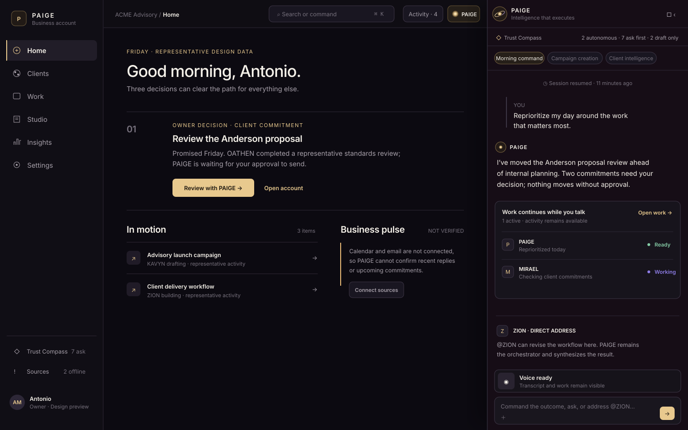

# PAIGE tenant account redesign — engineering handoff

**Status:** interactive, front-end-only prototype at `/tenant-redesign`  
**Audience:** tenant business owners only; this is not an operator, Fleet, or Super Admin surface.  
**Data contract:** every value and event is representative design data. No control calls Supabase, sends a message, mutates a record, or runs an agent.

## Visual preview



The preview above is a text-based, diff-compatible, exportable 1440×900 SVG design asset of the selected Command Spine direction: six-item tenant navigation, the Morning Command Center, and an expanded PAIGE conversation with active representative work. It is provided for immediate visual review; the interactive route remains `/tenant-redesign`.

## 1. Audit and decision

### Preserve

- The recognizable obsidian / near-black-violet environment, mineral-white type, warm spectral champagne PAIGE energy, restrained line icons, and precision borders.
- Deep-linkable structured business surfaces, especially CRM records, tables, timelines, calendar objects, and approvals.
- The shared `PaigeMark`, visible focus behavior, keyboard-command precedent, reduced-motion support, semantic status vocabulary, and honest preview/not-connected states.
- PAIGE's existing right-edge access pattern, developed into a persistent command spine rather than a support widget.

### Consolidate

- Command Center + PAIGE Chat become **Home**. Home is PAIGE's command center; PAIGE is not a competing nav destination.
- Calendar + Automations + Tasks + Projects + Runs + Approvals become **Work**.
- Client Support + conversations + pipeline + directory become **Clients**.
- Growth builders + documents + images + presentations + campaigns become **Studio**.
- Analytics + reporting + revenue intelligence become **Insights**.
- Integrations + Team + Marketplace + setup + billing + Trust Compass detail + knowledge + memory + agents + capabilities become searchable groups in **Settings**.

### Remove from permanent navigation

PAIGE, Trust Compass, Automations, Calendar, Client Support, Growth, Analytics, Billing, Marketplace, Business Vault, Integrations, Team, Setup, and every individual agent/capability tab. Their functionality remains addressable through the six outcome destinations, command search, contextual workspace, or Settings. Legacy deep routes should redirect; do not hard-delete them during implementation.

### Shell directions explored

1. **Command Spine — selected.** Six-item left navigation, business canvas, and persistent PAIGE spine at right. PAIGE expands into a full session; contextual work opens beside the same conversation; activity is disclosed on demand. This best preserves structured CRM trust while making PAIGE feel native to the entire environment.
2. **Conversation Canvas.** PAIGE dominates the center and business views open as sheets. Bold, but makes CRM/calendar browsing feel secondary.
3. **Workspace Dock.** Business canvas dominates and PAIGE expands from a bottom dock. Familiar, but risks reading as a bolted-on chatbot.

## 2. Information architecture

| Destination | Contents |
| --- | --- |
| Home | PAIGE briefing and conversation, priorities, overnight work, approvals, exceptions, recommendations, commitments |
| Clients | Accounts and contacts, conversations, pipeline, opportunities, health, activity, appointments, files, service history |
| Work | Overview, tasks, calendar, projects, workflows, runs, scheduled work, approvals |
| Studio | Artifact library, documents, images, presentations, reports, pages, campaigns, brand assets, projects and versions |
| Insights | Executive overview, revenue, sales, marketing, client health, operations, forecasts, recommendations |
| Settings | Business and brand, integrations, team, workforce, capabilities, playbooks, skills, memory, trust, notifications, models, API/MCP, billing |

### Old → new navigation map

| Old home | New home |
| --- | --- |
| Command Center; PAIGE / Chat | Home |
| Clients; Client Support | Clients |
| Calendar; Automations | Work |
| Growth; generated Documents / Vault assets | Studio |
| Analytics; Billing / Revenue reporting | Insights |
| Marketplace; Integrations; Team; Setup; Trust Compass detail; Knowledge; Sub-agents; Actions; Skills; PAIGE Team | Settings |
| Business Vault obligations / renewals / vendors | Work |
| Business Vault company / legal source records | Settings |
| Global Ask PAIGE and ⌘K | The same persistent PAIGE session, never a second thread |

## 3. Region model

There are never more than three contextual regions:

1. **Conversation:** transcript, voice, composer, clarification, contribution, recovery, approval.
2. **Workspace:** optional, dismissible artifact or business record. Opening it never clears the thread.
3. **Activity and approvals:** collapsed by default; opens as a drawer/overlay rather than a fourth column.

On Home, the briefing is the opening state of PAIGE's Command Center. On business surfaces, PAIGE persists as a collapsed or expanded right spine and receives the current route/record context. Agents never create their own rooms.

## 4. Connected prototype flows

1. **Morning Command:** Home → Review with PAIGE → reprioritized response → client or approval continuation.
2. **Campaign Creation:** In-motion campaign → visible KAVYN/ZION/OATHEN dispatch → strategic choice while work continues → proposal workspace.
3. **Client Intelligence:** Clients → selected authenticated record → structured record beside PAIGE → commitment/risk/recommendation → staged follow-up.
4. **Live Voice:** Voice toggle → listening state while proposal/image work remains visible → direction can change without canceling other work.
5. **Trust and Delivery:** reviewed artifact → inline Ask First approval → review workspace → approve once / remember / decline states. Prototype confirmation explicitly says nothing was sent.

## 5. Screen and state inventory

The 55 requested canvases are implemented as reusable modes rather than 55 disconnected pages. `P` means interactive prototype; `S` means a specified reusable state for production wiring.

| # | Screen/state | Coverage |
|---:|---|---|
|1–7|tenant nav; Home; conversation-only; collapsed/expanded rail; full PAIGE; mobile PAIGE|P: shell, rail controls, responsive full-screen mode|
|8–11|new/existing conversation; text; voice|P/S: resumed thread and composer/voice; production empty-thread state uses same components|
|12–16|multiple tasks; dispatch; direct address; waiting; inline approval|P: flow tabs, work strip, @ZION, question choices, approval|
|17–20|success; partial; failure/retry; resumed session|S/P: status rules below; resumed marker is P|
|21–28|document; image; presentation; revision; versions; review; delivered; linked client|P/S: document workspace and review/link metadata are P; image/presentation reuse the artifact renderer per type|
|29–35|client list; record; record + PAIGE; inbox; pipeline; opportunity update; follow-up approval|P/S: list/record/split/approval are P; inbox/pipeline reuse structured workspace specifications|
|36–44|Work; Calendar; project/workflow; Studio; Insights; Trust summary/detail; Settings; Integrations|P/S: destination indices and Trust summary are P; detailed leaves reuse index-to-workspace navigation|
|45–52|empty; disconnected; missing; loading; working; error; permission; mobile approval|P/S: disconnected/working/mobile approval are P; remaining canonical copy and transitions below|
|53–55|tablet; laptop; large screen|P: responsive CSS breakpoints and screenshot targets below|

Before production implementation is accepted, engineering should add a Storybook/state-lab route that directly renders every `S` entry. The prototype does not imply those backend states have occurred.

## 6. Component inventory

- Shell: `TenantNav`, `TopContextBar`, `PaigeRail`, `Workspace`, `ActivityDrawer`, `MobileDock`.
- Conversation: `PaigeHeader`, `ThreadHistory`, `MessageRow`, `RecordReference`, `MemoryRecall`, `ClarifyingQuestion`, `Composer`, `VoiceStrip`.
- Execution: `WorkPlan`, `WorkItem`, `AgentGlyph`, `Contribution`, `HandoffLine`, `RetryAction`.
- Artifact: `ArtifactCard`, `ArtifactHeader`, `PreviewRenderer`, `Editor`, `VersionDrawer`, `ReviewState`, `DeliveryDestination`.
- Trust: `CompassSummary`, `ApprovalCard`, `WhySheet`, `ScopeRule`.
- Business: `ClientTable`, `ClientRecord`, `RelationshipHealth`, `Timeline`, `Commitments`, `OpportunityDiff`, `Inbox`, `Pipeline`, `Calendar`, `Workflow`, `EvidenceView`.
- System: `Skeleton`, `EmptyState`, `MissingData`, `Disconnected`, `PermissionDenied`, `InlineError`, `Toast`.

## 7. Design tokens

The authoritative refined token specification is in **§18 → Updated typography tokens** and **§18 → Material tokens** below. Production should map these scoped prototype tokens into the platform semantic HSL layer; component call sites must not introduce independent color decisions. The earlier uniform prototype palette and unbundled DM Sans/Manrope references are superseded.

## 8. Responsive behavior

- **≥1440:** 216px navigation, fluid business canvas, 420px PAIGE; workspace overlays/reallocates the canvas. Content max 1100px.
- **1024–1439:** 72px icon navigation, 390–420px PAIGE, fluid workspace; never compress conversation below 360px.
- **768–1023:** one primary pane; Workspace is an edge sheet; PAIGE is a full-height overlay. A split is allowed only when at least 900px wide and the artifact benefits.
- **<768:** 64px bottom navigation; PAIGE and Workspace are full-screen routes. Back returns to the preserved conversation. Approval actions are at least 44px and stack into two columns / one column when needed. Composer respects safe-area and keyboard insets.
- Screenshot acceptance sizes: 375×812, 768×1024, 1280×720, 1440×900, 1920×1080.

## 9. Motion

- Hover/focus 120ms; drawers 180ms; workspace reveal 240ms.
- Motion must describe dispatch, handoff, approval, or completion. No ambient parallax, stars, or ornamental looping glow.
- Listening may use a restrained meter plus explicit text; progress uses deterministic labels, never an indefinite decorative animation.
- `prefers-reduced-motion: reduce` removes traces, pulses, draws, and spatial transforms while preserving state text and announcements.

## 10. State-transition maps

### Work item

`Queued → Working → Ready → Complete`  
Branches: `Working → Waiting for input | Needs approval | Partial | Failed | Blocked | Cancelled`. Retry returns only the failed item to `Working`; completed work remains intact.

### Artifact

`Requested → Producing → Ready → Reviewed → Approved → Delivered`. Revision from Ready/Reviewed/Approved creates a new version and returns it to Producing; the prior version remains available. Failed and Blocked are side states, not lifecycle shortcuts.

### Voice

`Ready → representative Listening → Understanding → PAIGE speaking → Delegating → Working → Waiting for approval → Complete → Interrupted → Reconnecting → Ready`. This is a visual state preview only; production microphone capture must insert explicit recording consent before Listening. Interruption immediately stops speaking and returns to Understanding. Network loss becomes `Connection interrupted` with transcript preservation; recovery becomes `Conversation resumed` in the same thread. Background work is separately labeled and may continue.

### Approval

`Draft → Ask First → Review | Approve once | Approve with scoped memory | Decline`. Approval never means delivered. Delivery transitions independently through Sending → Delivered or Blocked; irreversible effects are explained before approval.

## 11. Major interaction contract

| Interaction | Trigger | Visual response / state | Destination | Loading | Success | Failure | Mobile |
|---|---|---|---|---|---|---|---|
| Open PAIGE | right spine, PAIGE header, ⌘/Ctrl+J | spine widens; thread never resets | same route, contextual conversation | skeleton after 400ms | composer ready | offline composer with saved draft | full-screen conversation |
| Command search | ⌘/Ctrl+K or top button | command palette with outcomes/records | selected surface or same thread | progressive results | context chip added | retry search; keep query | full-screen palette |
| Dispatch work | send outcome request | acknowledgment + work plan within 100ms | conversation; optional activity | labeled Queued/Working | durable summary | partial results retained + scoped retry | status sheet, composer remains usable |
| Open artifact/record | contribution, row, or PAIGE link | Workspace reveals beside thread | contextual Workspace | typed skeleton | preview/edit available | error inline; close/retry | full-screen sheet + Back to conversation |
| Revise artifact | natural command or editor | active version returns to Producing; artifact stays visible | same Workspace | streaming diff/progress | new numbered version | retain prior version + retry | one pane; switch conversation/workspace |
| Voice | microphone, after consent | explicit Listening/Understanding/Speaking text + transcript | same thread | reconnect label after loss | transcript persists | saved transcript + Resume | full screen; 44px controls |
| Approve action | approval card action | lock target/scope, then execution state | same thread + activity | Sending is distinct | Delivered with destination/time/source | Blocked + Retry/Save draft | bottom sheet or full card |
| Direct agent | `@name` in composer | contribution attributed inside same thread | nowhere else | same work statuses | PAIGE synthesizes | PAIGE explains unavailable specialist | same composer |

## 12. Agent interaction rules

- PAIGE is always the interlocutor and orchestrator. A specialist never becomes a permanent tab or separate chat.
- Agent identity is name + function + restrained glyph + contribution/status, never portrait galleries.
- Direct address changes routing/attribution inside the current thread. PAIGE normally synthesizes the final answer.
- UI copy and data contracts must not depend on provisional specialist names. Only PAIGE and ZION are assumed stable; all other displayed names are provisional aliases supplied by roster configuration.
- Activity shows only machinery useful for confidence: worker, task, state, blocker, review attribution.

## 13. Trust Compass behavior

- Compact summary is persistent: **“Trust Compass · 2 autonomous · 7 ask first · 2 draft only.”** Counts are representative in the prototype.
- Inline cards explain: governing rule, preparer/reviewer, exact affected account/person, exact action after approval, reversibility, and destination.
- **Approve once** authorizes only this action. **Approve and remember** must first open a scope selector (this recipient / this client / this action type); never silently broaden authority. **Decline** keeps the draft and asks whether the user wants a revision.
- Permission denied copy: **“You can review this work, but your role cannot approve delivery.”** Action: **“Request approval.”**
- Trust is sovereignty: neutral, precise, and reversible where the underlying action permits it—never scolding language.

## 14. Canonical system copy

- Data: **“Representative design data — no live business systems are connected.”**
- Partial: **“The proposal is ready, but image 3 could not be produced. Continue with two images or retry the missing image.”**
- Disconnected: **“Email is not connected. Your draft is saved; connect an account before delivery.”**
- Missing: **“There is not enough source data to establish this relationship signal.”**
- Loading: **“PAIGE is locating the source records…”**
- Error: **“The source could not be reached. Nothing was changed.”**
- Permission: **“You can review this work, but your role cannot approve delivery.”**
- Voice consent: **“Microphone on. PAIGE will transcribe this conversation while you speak.”**
- Voice interruption: **“Interruption heard. I’m revising the direction while the other work continues.”**
- Connection loss/recovery: **“Connection interrupted. Your transcript is saved.”** / **“Conversation resumed. Two background items are still working.”**
- Completion: **“Campaign package complete: 5 artifacts reviewed, 1 pipeline update approved, and no external messages sent without approval.”**

## 15. Mocked vs expected functional behavior

| Prototype (mocked locally) | Production seam expected later |
|---|---|
| section/flow/rail/workspace state | router + persisted layout preferences |
| representative thread/work items | PAIGE thread/orchestration event stream |
| voice visual toggle | consent, microphone, transcription, interruption, reconnect |
| document and client previews | versioned artifact service and tenant-scoped CRM reads |
| approval confirmation | Trust Compass policy evaluation + approval/action bus |
| client/integration labels | RLS-scoped records and connection-health service |

No prototype control may be treated as proof that an integration, record mutation, run, review, or delivery exists in production.

## 16. Accessibility requirements

- Semantic `nav`, `main`, `aside`/dialog, headings, lists/tables, and buttons; one page-level `h1`.
- Keyboard reachable; visible ≥2px focus; `aria-current`, `aria-expanded`, labels for icon controls; Escape closes the top layer. Production integration must restore focus to the invoking control; the prototype preserves browser focus but does not implement a full dialog focus trap.
- AA text contrast, ≥3:1 focus and essential boundaries, non-color status language, ≥44px mobile targets.
- Polite live region for meaningful work transitions; assertive only for recording, connection loss, or action failure. Do not announce every progress tick.
- Recording consent precedes microphone capture. Transcript, work, artifact, record context, and approvals remain visible.
- Reduced motion, no focus stealing during streaming, responsive zoom/reflow, safe-area and virtual-keyboard handling.

## 17. Exportable assets and source files

- Shared PAIGE asset: `src/components/brand/PaigeMark.tsx` (SVG, theme-independent).
- Prototype system and exact rendered copy: `src/prototype/TenantRedesign.tsx`.
- Scoped tokens, layout, motion, focus, and breakpoints: `src/prototype/tenant-redesign.css`.
- This document is the implementation contract; production should extract components and platform tokens rather than connecting backend code directly to the prototype file.

## 18. Visual elevation pass — PR #560 refinement

The approved six-destination architecture and five prototype flows are unchanged. This pass integrates PAIGE's brand more deeply into the existing shell.

### Before and after

| Before | Refined direction |
|---|---|
| Uniform system typography | Architectural display hierarchy, sustained-use interface text, editorial artifact typography, and tabular operational data |
| Nearly flat dark rectangles | Eight functional material levels: environment, navigation, canvas, conversation, Workspace, artifact/record, authority, and elevated intelligence |
| Conventional right chat panel | Command Spine with intelligence aperture, environmental edge trace, context, active work, authority, and collapsed/full states |
| Initial-letter worker badges | Configurable geometric agent glyphs, `by PAIGE` naming, functional role, contribution, and handoff trace |
| Warning-style approval card | Sovereign authority frame with governing mode, scope, destination, actor/reviewer, reversibility, and distinct approval actions |
| Generic drawer | Workspace materialization edge, precision object header, provenance, version, review status, connected record, and mobile return to conversation |
| One voice toggle | A shared intelligence-state grammar with explicit state language and user-controlled representative voice-state preview |

### Updated typography tokens

No external font request is made. The prototype uses system-safe stacks already available on supported operating systems:

- Display: `Segoe UI Variable Display`, `SF Pro Display`, `Helvetica Neue`, Arial.
- Interface: `Segoe UI Variable Text`, `SF Pro Text`, system UI.
- Artifact/editorial: `Iowan Old Style`, Baskerville, `Times New Roman`.
- Data: system monospace with tabular numeric forms.

Major page statements use fluid 36–55px display type with a controlled editorial accent. Conversation is 14px/1.65 with a 58-character measure. Operational content is 10–14px by role; uppercase micro-labels are reserved for nonessential classification and never carry a state alone.

### Material tokens

| Layer | Token | Purpose |
|---|---|---|
| Obsidian environment | `--env: #08070b` | deepest operating environment |
| Navigation plane | `--nav: #0d0b11` | stable location and account identity |
| Business canvas | `--canvas: #100e14` | structured business work |
| Conversation plane | `--conversation: #121017` | persistent PAIGE intelligence |
| Workspace | `--workspace: #16131a` | materialized work instrument |
| Raised control | `--surface-raised: #211d27` | deliberate interactive elevation only |
| Artifact | `--artifact: #e9e4da` | produced mineral-white object |
| Sovereign authority | `#181510` + champagne metal rules | consequential permission layer |

Champagne is a restrained spectral trio (`#c7a978`, `#ead5aa`, `#fff0cf`) reserved for PAIGE presence, focus, authority, and execution edges. Violet metal indicates active execution, never generic AI decoration.

### PAIGE intelligence-state grammar

| State | Visual signature | Persistent meaning |
|---|---|---|
| Ready | static faceted intelligence aperture | available and context-aware |
| Listening | three-segment inward voice meter | microphone preview is listening |
| Understanding | controlled inward meter and state label | interpreting the latest command |
| Speaking | outward meter and state label | PAIGE is responding |
| Delegating | branching edge trace + worker handoff | specialists are being assigned |
| Working | deterministic edge trace + textual work count | execution continues in background |
| Waiting for approval | stationary Sovereign champagne bracket | action is held at the authority boundary |
| Completing | trace converges toward positive endpoint | results are being assembled |
| Interrupted | hard-stop edge break in the trace | a direction change was understood |
| Reconnecting | segmented trace joining across the edge | conversation context is being restored |

The five flows set meaningful baseline states. The representative voice-state control cycles through all ten visual states—Ready, Listening, Understanding, Speaking, Delegating, Working, Waiting for approval, Complete, Interrupted, and Reconnecting—without accessing the microphone. Flow, work, and approval surfaces use the same `.state-*` grammar. All state meaning remains textual when motion is reduced.

### Configurable agent identity

`AgentGlyph` receives an agent record rather than deriving visual identity from a hard-coded portrait. Each contribution contains display name, `by PAIGE`, configurable function, provisional-name disclosure, glyph variant, task, and status. PAIGE and ZION can remain locked while the other display names change without changing component geometry. Handoffs use a common precision trace rather than independent project-management colors.

### Workspace materialization

Opening work activates a single 300ms physically directed reveal: a champagne-to-cool-metal edge resolves from conversation into the Workspace, then the object surface settles. Artifact and CRM record treatments remain distinct. The artifact uses editorial mineral material, version/review state, provenance, connected account, and attribution; the record retains structured fields and an explicit representative-data basis. On mobile, **Conversation** is a visible return action and destination changes dismiss both Workspace and PAIGE overlays.

### Motion specification

- UI response: 120ms ease.
- Command Spine: 260ms `cubic-bezier(.22,1,.36,1)`.
- Workspace materialization: 300ms using opacity, translate, and clip reveal.
- Agent handoff: 180–320ms directional trace; no unrelated motion.
- Authority: 220ms edge ingress; it remains stationary while waiting.
- Completion: 360ms convergence, then stillness.
- Listening/working are the only repeating state motion and stop when the state changes.
- Reduced motion collapses every animation/transition to 0.01ms and one iteration while preserving state labels and geometry.

### Responsive refinement

- 1280×720: compact 72px navigation, 390px Command Spine, reduced vertical rhythm without shrinking primary type below the intended hierarchy.
- 1440×900: 216px navigation, proportional canvas, fluid 30vw Command Spine.
- 1920×1080: 232px navigation, 448px Command Spine, business content capped at 1240px.
- 2560×1440: 240px navigation, 480px Command Spine, business content capped at 1440px with 96px editorial gutters.
- Tablet/mobile: one primary layer; destination selection closes Workspace, closes navigation, and dismisses the full PAIGE overlay. PAIGE and Workspace use full-screen layers above the persistent five-action dock.

### PR #560 review findings resolved

1. `/tenant-redesign` is now an exact member of `CHATBOT_HIDDEN_ROUTES`, so the global production chatbot cannot create a second PAIGE surface in the prototype.
2. All desktop and mobile destination controls use the same transition: update destination, close mobile navigation, close Workspace, and collapse PAIGE on mobile. Opening a flow deliberately restores the correct full or expanded conversation state.

### Remaining mocked functionality

The prototype remains intentionally front-end-only. It does **not** record audio, transcribe speech, run orchestration, create or persist artifacts or versions, remember approval policies, send messages, mutate CRM records, connect sources, verify revenue, persist activity, or execute agent handoffs. Intelligence, work, record, Trust Compass, and delivery states are representative UI states. Controls that describe future scope selection or delivery remain visual contract surfaces until their production seams are connected.

## 19. Laptop-fit and spatial surface system — PR #561

This pass preserves the approved IA, brand elevation, conversation model, Workspace, five flows, agent orchestration, Trust Compass, and representative-only boundary. It changes how those surfaces occupy a finite viewport.

### Viewport contract

The prototype root is exactly `100dvh`, border-box, horizontally contained, and non-scrolling. Navigation, business canvas, conversation, Workspace body, and drawers own their scrolling independently through `min-height: 0` chains. The fixed mobile dock is excluded from the shell height rather than added to it. At heights below 800px and 730px, nonessential metadata folds before conversational type is reduced.

### Surface modes

| Surface | Mode | Behavior |
|---|---|---|
| PAIGE | Folded | 70px intelligence edge with mark, current state, work count, authority count, voice identity, and restore |
| PAIGE | Expanded | Normal rail with transcript, current context, activity, compact Trust row, voice, and persistent composer |
| PAIGE | Wide | 42vw reading plane with wider conversation and visible orchestration |
| PAIGE | Full Focus | PAIGE occupies the primary environment; Escape returns to Expanded while draft, flow, voice state, and work remain |
| Workspace | Docked | Participates at the business/PAIGE boundary; on compact laptops it replaces the center foreground rather than covering the entire shell |
| Workspace | Folded | 44px object strip retaining type, title, version/status, and restore control |
| Workspace | Floating | One viewport-constrained, draggable and resizable review surface with dock/focus recovery |
| Workspace | Full Focus | Workspace occupies the primary working area while navigation and safe recovery remain available |
| Activity / Trust / Transcript / Command | Slide-out | A single nonmodal layer with internal scrolling, safe Escape dismissal, and focus restoration |

### Window-state model

Prototype session state preserves `rail`, `workspaceOpen`, `workspaceMode`, current `flow`, conversation `draft`, active drawer, agent work, and Workspace object. Closing Workspace hides the surface but retains the flow/object. Folding retains an explicit status strip. Floating position and preset size are local front-end state only. Only one floating Workspace and one secondary slide-out can exist; opening another replaces the previous secondary surface.

Floating movement is clamped to recovery gutters within the viewport. The drag handle supports pointer movement and arrow-key movement (`Shift` = 30px step; otherwise 10px). Smaller/Larger controls provide the sole, viewport-clamped resizing path for both pointer and keyboard users; uncontrolled native corner resizing is deliberately disabled. Dock, Fold, Pop out, Full Focus, and Close are individually labeled and have tooltips.

### Spatial transitions

- Fold/unfold: 180ms.
- Drawer/slide-out: 220ms.
- Dock/undock: 240ms.
- Full Focus: 280ms.
- Direct floating movement has no easing lag.
- Workspace motion originates at its prior edge/position; it does not remount as an unrelated object.
- Reduced motion collapses travel to a one-iteration 0.01ms state change while retaining opacity, labels, and geometry.

### Responsive layout rules

| Viewport | Composition |
|---|---|
| 1280×720 | 68px navigation, ≥300px business recovery area, 370px PAIGE; Workspace defaults floating or center-docked; compact height chrome |
| 1366×768 | same laptop spatial contract; Workspace never uses a `100vw` width formula |
| 1440×900 / 1536×864 | 72px navigation, 360–390px PAIGE, docked Workspace may replace center foreground with fold recovery |
| 1920×1080 / 2560×1440 | authored wide gutters and capped content; Docked Workspace remains proportional |
| 768×1024 / 390×844 | one primary surface above a 64px dock; PAIGE, Workspace, and slide-outs use full-height overlays ending above the dock |

### Z-index hierarchy

1. Business canvas — 2
2. navigation/top context — 30–40
3. Docked/Folded Workspace — 50–51
4. PAIGE focus plane — 60–65
5. Slide-out drawers — 68
6. Floating Workspace — 72
7. Workspace Full Focus — 76
8. Mobile navigation/backdrop — 79–80
9. Mobile dock — 90
10. Skip link/focus recovery — 100

### Keyboard and focus

- `Escape`: restores floating/focus Workspace to Docked, then closes the active drawer, then Workspace, then mobile navigation, then PAIGE Wide/Full Focus.
- `Ctrl/Cmd + K`: opens the command surface and focuses its input.
- `Ctrl/Cmd + J`: opens PAIGE Wide.
- Workspace controls and resize presets are keyboard buttons; the floating handle accepts arrow keys.
- Opening surfaces remembers the invoking element; safe close restores focus. Drawers focus their close control. Mobile navigation focuses the first destination and restores the menu button when dismissed by its backdrop.
- A dedicated polite live region announces mode, drawer, Workspace, and destination changes; document content itself is not a live region.

### Representative demonstrations

- Campaign and delivery flows materialize the proposal; it can Fold, Dock, Pop out, resize, and enter Full Focus.
- Client Intelligence opens the structured record without replacing conversation; it can fold to its context strip and restore.
- Agents Working opens ZION/KAVYN/OATHEN contributions; each expands in place and folds back to the activity count.
- Trust Compass detail preserves rule, scope, agents, destination, and reversibility beside the affected artifact.
- Live Voice can expose a transcript slide-out while active work and Workspace state remain intact; ending/restoring layout never claims microphone capture.

### Production considerations and honest boundary

All spatial state is React session state. Dragging, preset resize, fold/dock/popout/focus, drawers, draft preservation, shortcuts, and representative screen transitions are functional. Backend orchestration, microphone capture, transcription, artifact/version persistence, approval memory, delivery, CRM mutation, integrations, and cross-session layout persistence remain mocked. Production should use a focus-stack utility, ResizeObserver-based clamping, real tooltips, persisted user layout preferences, and audited action/approval seams rather than connecting directly to prototype fixtures.

## 20. Repository-grounded account and PAIGE symbol refinement — PR #561

This representative state lab is grounded in `agent-ui-placement-spec.md`, `roles-permissions.md`, and `role-taxonomy-and-matrix.md`. It does not introduce or authorize a new account hierarchy.

### Account-state demonstrations

| Repository account type | Representative behavior in this route |
|---|---|
| Solo tenant | One business scope; no product scope switcher; clients remain CRM records |
| Sub-account | Independent tenant experience; parent is contextual text only; no siblings or cross-sub-account controls |
| Agency parent | Defaults to Agency overview; lists only explicitly authorized representative sub-accounts; aggregate reads remain available; campaign/delivery actions are disabled until a sub-account is entered |
| Agency entered scope | Persistent top-app and PAIGE `Viewing as [business] · All actions logged · Exit`; represented write confirmation names the business |
| Super Admin/God | Distinct `PAIGE OPERATOR`, Platform/Fleet default, audited tenant entry, persistent Viewing-as, and disabled representative two-key/reason-code break-glass surface |
| Client | Separate tenant-authored Customer Portal demonstration; no tenant nav, agency/platform scope controls, Trust rail, or product switcher |

The account selector is visibly labeled **Representative account** and is a prototype state-lab control, not a production scope grant. Business-scope changes clear the previous tenant’s flow/conversation, Workspace, agent state, memory-equivalent UI, Trust drawer, draft, and approval/voice state. `PaigePanel` is keyed by account and business scope so local child state cannot survive a boundary change.

**Business scope is not CRM context.** The PAIGE header shows each separately when relevant—for example `Business scope: [authorized tenant]` and `CRM context: [tenant-scoped client]`. Selecting a CRM client changes only the structured CRM Workspace. Selecting a business clears the prior tenant context before representative content appears.

### Production authorization boundary

The prototype never authorizes from a generic `admin` label. Production wiring must preserve the repository’s three distinct stores:

- Global `user_roles` — platform Class A authority only; no `tenant_id`.
- Tenant `tenant_members` — tenant roles and membership.
- Agency `agency_team_members` — agency authority and `scoped_subaccounts` authorization.

Cross-tenant authority must use server-proven `is_platform_operator()`; owner-integrity gates remain `is_platform_owner()`. Tenant authority requires the tenant match plus tenant membership. Agency scope requires agency membership and the authorized sub-account subset. Every production act-as requires RLS, real/effective actor logging, append-only audit, visible exit, and extra write confirmation. Symbols and React state communicate boundaries; they never prove permission.

### Shared `PaigeSymbol` contract

```tsx
<PaigeSymbol territory="command" state="ready" size="md" treatment="spectral" />
<PaigeSymbol territory="sovereign" state="ask-first" size="sm" treatment="monochrome" />
<PaigeSymbol territory="artifact" state="materializing" size="md" treatment="spectral" />
```

The discriminated TypeScript API accepts `territory`, territory-valid `state`, explicit size (`favicon` through `xl`), `spectral|monochrome`, `auto|light|dark`, opt-in semantic animation, optional accessible `label`, and replaceable `className`. It uses per-instance gradient IDs, is decorative by default, simplifies at favicon size, preserves currentColor-based monochrome geometry for Sovereign/Artifact, and stops all motion under reduced-motion preferences. `PaigeMark` remains the backward-compatible orbital Command geometry and now accepts `label={null}` when nested to avoid duplicate accessible names.

### Territory semantics

- **Command:** corporate/product identity and PAIGE presence—Ready, Listening, Understanding, Speaking, Delegating, Working, Complete, Interrupted, Offline.
- **Sovereign:** Trust Compass, governance, approval, autonomy, Viewing-as, audit, security boundaries—Autonomous, Ask First, Draft only, Restricted, Escalated, Approved, Declined.
- **Artifact:** Workspace, Studio, materialized work, versions—Requested, Materializing, Ready, Reviewed, Approved, Delivered, Failed.

Artifact uses asymmetric open material planes rather than a four-part/octagonal interlock. It remains **provisional** pending formal similarity screening and can be replaced behind `PaigeSymbol` without changing callers.

### `PaigeMark` migration audit

The repository audit found 43 rendered `PaigeMark` instances across 27 TSX files. Migration is intentionally incremental:

- **Corporate/product identity:** AdminLayout, AgencyLayout, StudioLayout/TopBar, OperatorApp shell, Auth, GetStarted, Welcome, OwnerWelcome, JoinPlatform, OperatorLogin, Unsubscribe, selected PaigeHome/PageHeader/StudioHome headers.
- **PAIGE presence/invocation:** AgentRail, PaigeConsole, PaigeCommandBar, PaigePlatformDesk, PaigeTeamDirectory, PaigeAttribution, and the tenant prototype Command Spine.
- **Generation/materialization candidates:** StudioBuildingScreen, StudioShell, StudioHome generation, ArtifactPreview coalescing, Operator/PlatformDesk loading states.
- **Portal branding fallback:** FloatingChatbot and BookingPage only after tenant logo/monogram resolution; tenant branding remains authoritative.
- **Decorative legacy:** ArtifactPreview watermark and any optional hero decoration; these should become Artifact monochrome or be removed rather than inherit Command identity.

No mass replacement was performed. The prototype migrates representative Command, Sovereign, and Artifact usages; existing production call sites retain `PaigeMark` until their semantics are reviewed.

### Required visual matrix

Settings contains a symbol state lab showing all three territories in dark spectral, light spectral, monochrome, and favicon-size forms. Command state follows folded/expanded/voice/working PAIGE state; Sovereign appears in compact Trust, approval, Viewing-as, and break-glass states; Artifact appears during Workspace materialization. State text remains visible and no symbol carries meaning through color or motion alone.

### Honest functional boundary

Account switching, context clearing, symbols, scope banners, read-only agency gating, disabled break-glass form, and state demonstrations are local prototype behavior. They do not query membership, authorize access, log an audit row, expose PII, change a tenant, remember approval, or perform a write. Production must connect these surfaces to server-authorized membership, RLS, real/effective actor seams, Trust Compass policy, and append-only auditing.

## 21. Capability recovery and integration architecture (2026-08-21)

The visual shell now exposes the full product depth through destination-specific secondary navigation rather than adding primary destinations. The checked-in [capability recovery matrix](./tenant-capability-recovery-matrix.md) is the evidence ledger: every row records the existing route/component/data seam, an honest build classification, new home, Trust requirement, deep-link policy, and acceptance test. The [route map](./tenant-platform-route-map.md) defines the target nesting without retiring current URLs.

### Before / after

- **Before:** Clients demonstrated a generic relationship list; Work, Studio, Insights, and Settings were shallow indexes with no visible connection to the current operational graph.
- **After:** Clients exposes the nine approved CRM sub-views and a first-class pipeline board design linked to the real `PipelineAdmin`; Work exposes durable runs and approval authority; Studio previews the existing immersive `StudioLayout` / `StudioHome` / `StudioShell` / `VibeStudio` family; Insights labels connected, incomplete, and unverified evidence; Settings exposes the complete configuration taxonomy.
- **Unchanged:** the six destinations, shared PAIGE conversation, Command Spine, spatial Workspace, five flows, account taxonomy, Trust Compass, responsive shell, and representative-data boundary.

### Reuse contract

Production integration reuses components rather than recreating them:

| New home | Required reuse |
|---|---|
| Clients / Contacts | `ContactsAdmin`, `ContactDetail`, `ClientJourney` |
| Clients / Conversations | `ClientsConversations` and its subordinate tab family |
| Clients / Pipeline | `PipelineAdmin`, `DealDrawer`, `NewDealDialog`, `PipelineFromProgramDialog` |
| Work | `PlanningAdmin`, `CalendarAdmin`, `WorkflowsList`, `WorkflowRuns`, `WorkflowRunDetail`, `ApprovalsInbox`, `ApprovalDetail` |
| Studio | `StudioLayout`, `StudioHome`, `StudioLibrary`, `VibeStudio`, `StudioShell`; the session is PAIGE, so no second rail mounts |
| Insights | `AnalyticsDashboard`; Sales/Forecast reads must reuse the Pipeline deal/stage scope |
| Settings | existing `Setup*`, `IntegrationsHub`, `TeamHub`, `SubAgentsAdmin`, `SkillsHub`, Marketplace, knowledge, autonomy and billing components |

### Deep-link and migration rule

No operational route was removed. Links in the prototype point to current canonical routes and clearly state that an authorized tenant session is required. A route can move only after the same connected component is mounted in its new nested home, tenant/tier/Trust behavior passes the matrix test, old URL redirects are verified, and cached business/client/conversation/workspace/agent/memory/authority state is cleared on scope change.

### Floating conversation boundary

`GatedChatbot` now suppresses the generic floating chatbot throughout `/admin` in addition to the agency, business, solo, operator, and prototype shells. Authenticated tenant operation therefore has one PAIGE entry model: its owned workspace/rail/edge control. This does not delete `FloatingChatbot`; it remains available to technically separate properties where that support-style surface is appropriate.

### Remaining mocked or owed behavior

The redesign route still makes no Supabase query, RPC, Realtime subscription, Storage request, Edge Function invocation, send, approval, tenant switch, workflow run, or artifact mutation. Pipeline drag/drop, deal values, Studio generation, source health, durable run evidence, client health, cross-surface recommendations, tenant switch authorization, and all shown PAIGE execution remain representative here. Their production seams and acceptance gates are enumerated in the recovery matrix; “planned / owed” and “live but incomplete” must remain visible until those gates pass.

## 22. Live-data switcher correction (2026-08-21)

The repository and production-access audit found that the prototype had embedded fictional business and CRM names in its account-state demonstration. Those names were useful layout fixtures but were not authenticated production facts and therefore do not belong in a tenant or client selector.

The public `/tenant-redesign` route now embeds **zero tenant names and zero CRM records**. Solo/sub-account headers say that the current authorized name is withheld; the agency control remains in aggregate scope and states that live tenants require authentication; operator tenant entry is disabled until a server-authorized list exists; Clients and Pipeline render honest no-data states with links to the connected, protected surfaces.

Production must populate the business switcher only from the existing authenticated scope seams:

- solo/sub-account: the current server-resolved tenant only;
- agency: `agency_list_my_subaccounts` / the authorized membership subset only;
- operator: the audited platform tenant registry and act-as seam only;
- CRM clients: tenant-scoped `clients` records under RLS, never mixed into the tenant selector.

No build-time list, documentation example, prior chat fixture, or client-side generic `admin` assumption may seed the switcher. If Supabase is unavailable or the user has no authorized scopes, the correct UI is an empty/error state—not representative names.

### Verification limitation

This environment contains the production project ref and public publishable key, but no authenticated Supabase MCP connection, service-role credential, database URL, GitHub remote, or authenticated GitHub CLI session. Direct external access is blocked by the environment proxy. Consequently, no claim about the current production tenant/client names is made here. The safe correction is to remove unverified names and make the production seam authoritative when an authenticated environment runs the surface.

## 23. Requirement gap audit and corrected floating-chat invariant (2026-08-21)

The complete line-by-line comparison is checked in at [`tenant-redesign-gap-audit.md`](./tenant-redesign-gap-audit.md). Its conclusion is intentionally stricter than earlier summaries: Phase 1 is substantially complete; Phase 2 is partial; Phase 3 is early; Phase 4 is prototype-only; Phase 5 has not started. Canonical links and design compositions are not equivalent to mounting and verifying connected operational components.

The prior global-chat suppression was incomplete. Exact matching missed `/tenant-redesign/`; trailing-slash prefixes missed bare `/agency`, `/business`, and `/solo`; `/app` remained eligible; and ad hoc `startsWith('/admin')` could suppress unrelated names. `shouldRenderFloatingChatbot` now owns one boundary-aware rule for PAIGE-owned shells, and its regression tests cover root, nested, trailing-slash, and near-prefix public paths.

## 24. Connected-surface navigation decision (2026-08-21)

Destination and sub-view navigation now remain inside the PAIGE shell and update durable `destination` / `view` query parameters. The top context acts as a breadcrumb, browser back/forward restores the selected design surface, and PAIGE remains present. Duplicate legacy-route buttons were removed.

Until a real operational component is adapted and mounted, one shared `ConnectedFallback` appears at the Canvas boundary with the exact labels `Migration bridge / temporary` and `Open connected version`. It opens the canonical route in the same tab. This is explicitly an incomplete migration state—not integration. The bridge must be removed atomically when the real component mounts and passes its matrix acceptance test.

The route map defines Canvas, Split, Focus, Docked panel, and optional Pop-out behavior. Ordinary destination navigation never pops out, no iframe or nested legacy shell is allowed, and Studio must suppress the outer PAIGE rail because the Studio session itself is PAIGE.

## 25. Vibe Studio production reconciliation and integrity gate (2026-08-21)

The supplied GitHub/Supabase audit establishes that Studio is substantial live code with connected production substrate, but not a fully proven lifecycle and not mounted inside the tenant redesign. The detailed repository reconciliation is [`vibe-studio-integrity-audit.md`](./vibe-studio-integrity-audit.md); the recovery matrix now contains a 20-row Studio lifecycle annex.

The public redesign no longer labels Studio entry views `Live and connected`. They display `Live but incomplete`, name the existing Studio component family, expose an integrity gate, and retain one temporary connected-version bridge. This distinguishes a connected substrate from completed redesign integration.

Repository migrations describe a restrictive tenant wall and narrow owner/template/admin SELECT policies for `studio_sessions` and parent-session-scoped SELECT for `studio_artifact_versions`, with authenticated direct writes revoked. The supplied production audit reports additional permissive `ALL` policies that may widen reads. Because this environment cannot retrieve their exact live names/expressions, no guessed destructive migration was authored. A checked-in read-only catalog audit must identify exact drift before a CLI-generated remediation and authenticated multi-user proof.

The real Studio mount is blocked on: policy composition, explicit collaboration scope, private deliverable/signed URL tests, Edge inventory reconciliation, tenant-switch invalidation, and the acceptance gates in the lifecycle annex. After those pass, `StudioLayout`, `StudioHome`, `StudioShell`, `VibeStudio`, and `StudioLibrary` should replace the representative composition atomically without adding the outer PAIGE rail to immersive sessions.

## 26. Business Vault, Marketplace, and Capabilities reconciliation (2026-08-21)

The detailed evidence and integration gates are checked in at [`business-vault-marketplace-audit.md`](./business-vault-marketplace-audit.md). The recovery matrix now includes separate lifecycle annexes for both territories.

Settings preserves three distinct homes: **Business Vault** for verified business facts and evidence, **Marketplace** for discovery/purchase/install, and **Capabilities** for operating installed items. The prototype now demonstrates this distinction without displaying production rows or pretending that a unified Vault exists. Vault health is explicitly `Not established`; internal secrets are never treated as user-visible Vault records; Marketplace is labeled `Live substrate · UX incomplete`; and Capabilities is labeled as an incomplete post-install lifecycle.

The supplied production audit is evidence dated 2026-08-21, not prototype fixture data. Production integration must derive catalog visibility, memberships, manifests, price, tenant, permissions, and Trust state on the server. The prototype performs no query, purchase, install, score calculation, share, or secret retrieval.

## 27. Two-way portal and theme reconciliation (2026-08-21)

The portal evidence and design contract are checked in at [`two-way-client-portal-audit.md`](./two-way-client-portal-audit.md), with a 26-row lifecycle annex in the recovery matrix. Portal remains the external presentation of the same Clients relationship, thread, engagement, request, approval, booking, file and activity records—not a second CRM or inbox.

The prototype now exposes persistent light and dark modes, system-preference initialization, accessible theme controls in the tenant shell and customer portal preview, and light/dark PAIGE mark treatment. The portal demonstration also names its client-visible audience and AI role. These are representative front-end states; no portal record, invitation, message, action, booking, upload or approval is created.
